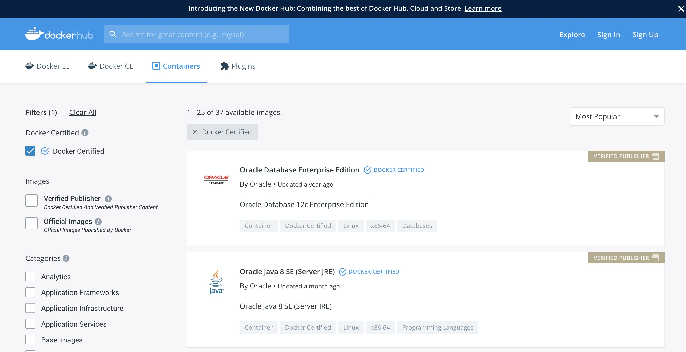
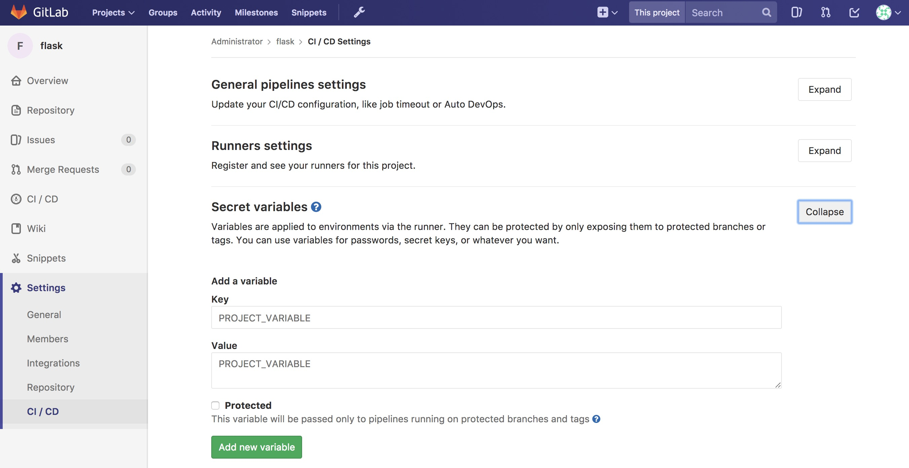
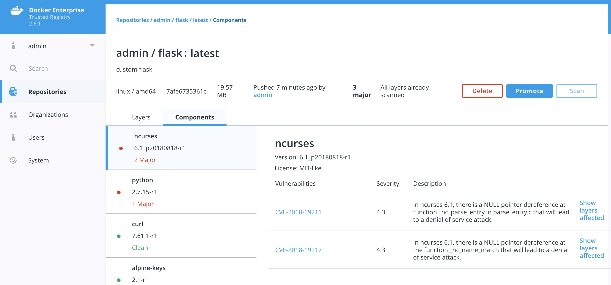
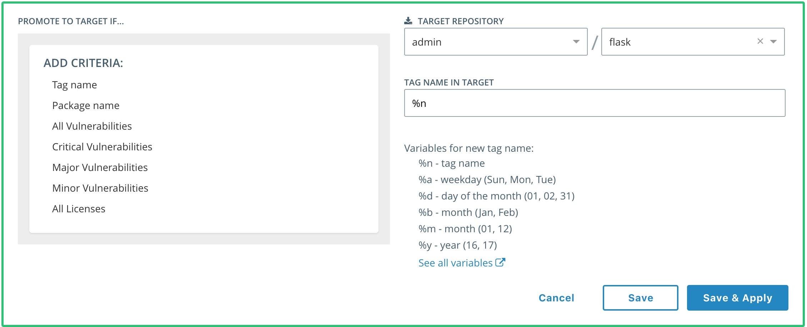
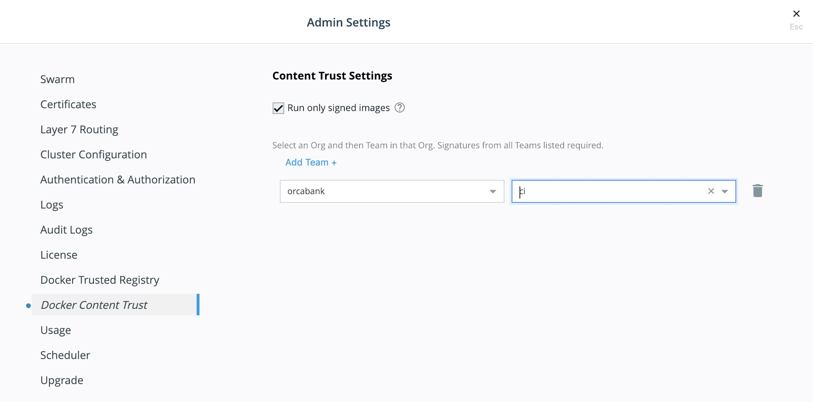

# Building a Docker Secure Supply Chain

## Introduction

Creating a Secure Supply Chain of images is vitally important. Every organization needs to weigh ALL options available and understand the security risks. Having so many options for images makes it difficult to pick the right ones. Ultimately every organization needs to know the provenance of all the images, even when trusting an upstream image from [hub.docker.com](http://hub.docker.com). Once the images are imported into the infrastructure, a vulnerability scan is vital. Docker Trusted Registry with Image Scanning gives insight into any vulnerabilities. Finally, everything needs to be automated to provide a succinct audit trail.

## What You Will Learn

This reference architecture describes the components that make up a Secure Supply Chain. Topics include using Git, GitLab, and [the Docker Hub](http://hub.docker.com) to feed the supply chain. All the tools listed and demonstrated within this reference architecture can be replaced with alternatives. The Secure Supply Chain can be broken into three stages:

- Stage 1 is a code repository.
- Stage 2 is Continuous Integration.
- Stage 3 is a registry that can scan images.

Even though there are many alternatives, this document focuses on one set:

- GitLab (Code Stage 1)
- GitLab Runner (Build Automation Stage 2)
- Docker Trusted Registry (Scanning and Promotion Stage 3)

One motto to remember for this reference architecture is "No human will build or deploy code headed to production!"

## Prerequisites

Before continuing, become familiar with and understand:

- [Docker Concepts from the Docker docs](https://docs.docker.com/engine/understanding-docker/)
- [Securing Docker EE and Security Best Practices](https://success.docker.com/Architecture/Docker_Reference_Architecture%3A_Securing_Docker_EE_and_Security_Best_Practices)

## Abbreviations

The following abbreviations are used in this document:

- UCP = Universal Control Plane
- DTR = Docker Trusted Registry
- DCT = Docker Content Trust
- EE = Docker Enterprise Edition
- RBAC = Role Based Access Controls
- CA = Certificate Authority
- CI = Continuous Integration
- CD = Continuous Deployment
- HA = High Availability
- BOM = Bill of Materials
- CLI = Command Line Interface

## Why

There are several good reasons why you need a **Secure Supply Chain**. Creating a **Secure Supply Chain** is theoretically mandatory for production. Non-production pipelines can also take advantage of having an automated base image. When thinking about Supply Chain, a couple of key phrases come to mind:

- "No human will build or deploy code headed to production!"
  - It helps prevent malicious code from being snuck into approved code. It also helps prevent insider threat.
- "Everything needs an audit trail."
  - Being able to prove the what, when, why, and how questions makes everyone's job easier.
- "Every supply chain needs a known good source."
  - Would you build a house in the middle of a swamp?

Ideally you want the shortest path for images. You want to guarantee the success of the image making it through the chain. Limiting the steps is a great way to reduce the number of moving parts. At a high level, only two components, _Git (GitLab)_ and _Docker Trusted Registry (DTR)_, are necessary.

Below is a basic diagram of the path today.


## Known Good Source

No matter how good a supply chain is, it all depends on starting with a "Known Good Source". Stage 1 can be broken down into two possible starting points.

- Automated, pre-built, verified, and preferably certified images from [the Docker Hub](https://hub.docker.com)

- A private, secure Git repository with Dockerfiles and other YAMLs

There are good reasons for both. The Docker Hub path means that the upstream image is inherited with a bit of risk in how the vendor built it. The Git path means there are risks taken when building the image. Both entry points have their pros and cons. Both starting points have verifiable contents to ensure they are a "known good source".

The next sections look at both sources in more detail.

## Docker Hub, The New Docker Hub

Docker Hub, [hub.docker.com](https://hub.docker.com), should be the first place to look for images that are ready for use. The owners of the images carry the responsibility of updating and ensuring that there are no vulnerabilities. Thanks to Docker Hub, all Certified and Official images are scanned for vulnerabilities. Docker Hub and Vendors take things a step further with Certified images. Certified images go through an [extensive vetting process](https://success.docker.com/Store), and essentially come with a guarantee from the vendor and Docker that the container will work. The Store also includes Official images. Official images, updated regularly, are built by Docker. [Docker Hub](https://hub.docker.com) also contain community images, which should be used at last resort.


### Picking the Right Upstream

Picking the right images from [Docker Hub](https://hub.docker.com) is critical. Start with [Certified Images](https://blog.docker.com/2017/03/announcing-docker-certified/), then move on to official images. Lastly, consider community images. Only use community images that are an automated build. This helps ensure that they are updated in a timely fashion.  Verification of the freshness of the image is important as well.

From a blog post on [Certified Images](https://blog.docker.com/2017/03/announcing-docker-certified/):

*The Docker Certification Program is designed for both technology partners and enterprise customers to recognize Containers and Plugins that excel in quality, collaborative support, and compliance. Docker Certification is aligned to the available Docker EE infrastructure and gives enterprises a trusted way to run more technology in containers with support from both Docker and the publisher. Customers can quickly identify the Certified Containers and Plugins with visible badges and be confident that they were built with best practices, tested to operate smoothly on Docker EE.*


When searching [Docker Hub](https://hub.docker.com) for images, make sure to check the **Docker Certified** checkbox.



One of the great features about [Docker Hub](https://hub.docker.com) is that the images are scanned for security vulnerabilities. This allows for inspection of the images before pulling.


When using upstream images that are not Official or Certified, ensure that the image is an "automated build". Reviewing the Dockerfile is an important step to ensure only the correct bits are in the image. Last resort is to consider creating an "automated" image for the community.

Please keep in mind that ANY image pulled from Hub or Store should also receive the same level of scrutiny through Docker Trusted Registry.

## Git - (GitLab CE)

In today's modern enterprise, version control systems are the center of all code. Version control systems such as Git are also a great way to keep track of configuration, becoming the "Source of Truth" for your enterprise. There are several companies that produce Git servers. [GitLab CE](https://hub.docker.com/_/gitlab-community-edition) is a great open source one. In the following example, GitLab Community Edition is used.

The ideal Git repo structure contains all the files necessary for building and deploying. Specifically the `Dockerfile`, any code, and the `stack.yml`. The `Dockerfile` is the build recipe for the Docker image. The `stack.yml`, also known as a compose YAML file, is used for describing the stack. 

### Set Up GitLab

GitLab has some good instructions for [setting up with Docker images](https://docs.gitlab.com/omnibus/docker/). Because Git uses SSH port (22) by default, either the host's port or Git's port needs to be changed. The following shows how to move GitLab's port to 2022. For production, moving the host's SSH port might make more sense. Also, permanent storage is needed for a stateful install. Here is an example Docker Compose for setting up Gitlab-CE:

```yaml
version: "3.3"
services:
  gitlab:
    image: gitlab/gitlab-ce:latest
    ports:
      - 80:80
      - 443:443
      - 2022:22
    volumes:
      - /var/run/docker.sock:/var/run/docker.sock
      - /srv/gitlab/config:/etc/gitlab
      - /srv/gitlab/logs:/var/log/gitlab
      - /srv/gitlab/data:/var/opt/gitlab
    restart: always
    environment: 
      - GITLAB_OMNIBUS_CONFIG="external_url 'http://my.domain.com/'; gitlab_rails['lfs_enabled'] = true;"
    networks:
      gitlab:

  gitlab-runner:
    image: gitlab/gitlab-runner:alpine
    volumes:
      - /var/run/docker.sock:/var/run/docker.sock
      - /srv/gitlab-runner/config:/etc/gitlab-runner
      - /root/.docker:/root/.docker
      - /root/.notary:/root/.notary
    restart: always
    networks:
      gitlab:

networks:
  gitlab:
```

Save this as `gitlab.yml`. Then execute the following commands:

```bash
sudo docker swarm init
sudo docker stack deploy -c gitlab.yml gitlab
```

Note that it will take a minute for GitLab to start.

## Continuous Integration Automation

In order to leverage the idea of "No human will push code to production," you need to automate all the things. Thanks to recent editions of GitLab, you can configure CI/CD functions directly. This greatly simplifies setup and maintainability. To take advantage of CI/CD, first register at least one runner. The runner is included in the `gitlab.yml` from the previous setup section. The next step is to configure the runner.

### Configure the Runner

To activate the runner installed with the `docker stack deploy` from the previous section, you need to get the runner token. Navigate to **Admin Area** --> **Runners**. Here you can find the token needed to register the runner.


Luckily there is a shortcut to registering the runner. Simply ssh into the GitLab node and run the following Docker command (Notice the token from the GitLab CE page):

```bash
docker exec -it $(docker ps --format '{{.Names}}\t{{.ID}}'|grep runner|awk '{print $2}') gitlab-runner \
register -n \
--url http://gitlab.example.com \
--registration-token $token \
--executor docker \
--description "local docker" \
--docker-image "docker:latest" \
--docker-volumes "/var/run/docker.sock:/var/run/docker.sock" \
--docker-volumes "/root/.docker:/root/.docker"
```

Once registered you should see the Runner available with a `shared` tag. You also want to make sure that `Run untagged jobs` is checked and that `Lock to current projects` is unchecked.

### Repository Contents

One great way to leverage the "Source of Truth" is to store all the contents that compose the image and the stack together. Simply create a directory for each component in the root of the repository, then store only the bits that make up that component in its appropriate directory. In this example there is a three tier app made up of "web," "middleware," and "db". The `stack.yml` would also be stored at the root level of the repository. Ideally, the directory structure would contain:

1. Directories for the components. Each directory would contain the specific `Dockerfile`. Source bits and artifacts for each component in a separate directory.
2. A `stack.yml`, which is used for `docker stack deploy`.
3. GitLab CI declarative, `.gitlab-ci.yml`.


Don't forget to utilize multi-stage builds in Dockerfiles. Multi-stage builds help to reduce the size of the resulting image. Please take a look at the [multi-stage documentation](https://docs.docker.com/develop/develop-images/multistage-build/).

#### Dockerfile Best Practices

It is worth looking at what makes a good `Dockerfile`. One thing that is commonly overlooked is the use of labels. Since it is simply extra metadata for the image itself it doen't affect the run time at all. We highly recommend adding labels from [opencontainers spec](https://github.com/opencontainers/image-spec/blob/master/annotations.md). And the most important label of all is the `org.opencontainers.image.authors`. This is a great resource for tracking back who wrote the dockerfile. You can follow this Dockerfile example:

```text
FROM alpine

ARG BUILD_DATE
ARG BUILD_VERSION

LABEL org.opencontainers.image.authors="clemenko@docker.com" \
      org.opencontainers.image.source="https://github.com/clemenko/dockerfiles/tree/master/demo_flask" \
      org.opencontainers.image.created=$BUILD_DATE \
      org.opencontainers.image.title="clemenko/flask_demo" \
      org.opencontainers.image.description="The repository contains a simple flask application " \
      org.opencontainers.image.source=$BUILD_VERSION

RUN apk -U upgrade && apk add --no-cache curl py-pip  &&\
    pip install --no-cache-dir --upgrade pip &&\
    pip install --no-cache-dir flask redis pymongo &&\
    rm -rf /var/cache/apk/*

WORKDIR /code
ADD . /code
EXPOSE 5000
HEALTHCHECK CMD curl -f http://localhost:5000/healthz || exit 1
CMD ["python", "app.py"]
```

### Build Declarative

Here is where the CI magic happens. GitLab looks to a file at the root of the repository called `.gitlab-ci.yml`. This is the CI declarative file.

> **Note:** Check out the [GitLab documentation](https://docs.gitlab.com/ee/ci/yaml/README.html) on this topic.

Consider the following scenarios. Be sure to configure the variables in each individual repository.

Here is a good example of building an image from git itself.

```text
# Official docker image.
variables:
  DOCKER_DRIVER: overlay2

image: docker:latest

before_script:
  - docker login -u $DTR_USERNAME -p $DTR_PASSWORD $DTR_SERVER

build:
  stage: build
  script:
    - docker build --pull -t dtr.example.com/admin/"$CI_PROJECT_NAME"_build:$CI_JOB_ID .
    - docker push dtr.example.com/admin/"$CI_PROJECT_NAME"_build:$CI_JOB_ID
    - docker rmi dtr.example.com/admin/"$CI_PROJECT_NAME"_build:$CI_JOB_ID
```

Here is a good example of a `.gitlab-ci.yml` for pulling, tagging, and pushing an image from hub.docker.com to your DTR.

```text
# Official docker image.
variables:
  DOCKER_DRIVER: overlay2

image: docker:latest

before_script:
  - docker login -u $DTR_USERNAME -p $DTR_PASSWORD $DTR_SERVER

stages:
  - signer

signer:
  stage: signer
  script:
    - docker pull $DTR_SERVER/admin/flask:latest
    - export DOCKER_CONTENT_TRUST=1
    - docker push $DTR_SERVER/admin/flask:latest
    - docker rmi $DTR_SERVER/admin/flask:latest
```



GitLab is now setup with variables and build declaratives. Next, add a trigger to your project.

### Pipeline Triggers

GitLab includes an awesome CI tool as well as a way to trigger the pipeline remotely. GitLab calls these triggers. The easiest way to create these triggers is to navigate to **Projects** --> **Settings** --> **CI/CD** --> **Pipeline triggers** --> **Expand**.


Here is an example of the trigger format. `http://gitlab.example.com/api/v4/projects/$PROJECT/trigger/pipeline?token=$TOKEN&ref=$REF`. The three fields that are needed here are `$PROJECT`, `$TOKEN`, and `$REF`. `$REF` should be set to the branch name. `$TOKEN` should be set to the token you get from GitLab. The best way to get the `$PROJECT` is to simply copy the URL in the **Pipeline Triggers** page. You will need the Pipeline Triggers later.

Next, add Docker Trusted Registry (DTR).

## Docker Trusted Registry

DTR is much more than a simple registry. It includes some great features that increase the strength of the supply chain. Some of the new features include image promotion and immutability.

The following sections look at some of these new features.

### Image Scanning

Starting with version 2.2.0, DTR includes on-site image scanning. The on-site scanning engine within DTR scans images against the [CVE Database](https://cve.mitre.org/). 
First, the scanner performs a binary scan on each layer of the image, identifies the software components in each layer, and indexes the SHA of each component. This binary scan evaluates the components on a bit-by-bit basis, so vulnerable components are discovered regardless of filename, whether or not they're included on a distribution manifest or in a package manager, whether they are statically or dynamically linked, or even if they are from the base image OS distribution.

The scan then compares the SHA of each component against the CVE database (a "dictionary" of known information security vulnerabilities). When the CVE database is updated, the scanning service reviews the indexed components for any that match newly discovered vulnerabilities. Most scans complete within a few minutes; larger repositories may take longer to scan depending on your system resources. The scanning engine gives you a central point to scan all the images and delivers a Bill of Materials (BOM), which can be coupled with [Notary](#dtr-notary) to ensure an extremely secure supply chain for your images.

Starting with DTR 2.3.0, the scanning engine can also scan Windows binaries.


#### Set Up Image Scanning

Before you begin, make sure that you or your organization has purchased a DTR license that includes Docker Security Scanning and that your Docker ID can access and download this license from the Docker Hub.

By default, when Security Scanning is enabled, new repositories automatically scan on `docker push`, but any repositories that existed before scanning was enabled are set to "scan manually" mode by default. If these repositories are still in use, you can change this setting from each repository's **Settings** page.

To enable Image Scanning, go to **Settings --> Security**, select **Enable Scanning**, and then select whether to use the Docker-supplied CVE database (**Online** — the default option) or use a locally-uploaded file (**Offline** — this option is only recommended for environments that are isolated from the Internet or otherwise can't connect to Docker for consistent updates).

Once enabled in online mode, DTR downloads the CVE database from Docker, which may take a while for the initial sync. If your installation cannot access `https://dss-cve-updates.docker.com/` you must manually upload a `.tar` file containing the security database.

- If you are using **Online** mode, the DTR instance contacts a Docker server, downloads the latest vulnerability database, and installs it. Scanning can begin once this process completes.
- If you are using **Offline** mode, use the instructions in **Update scanning database - offline mode** to upload an initial security database.


#### CVE Offline Database

If your DTR instance cannot contact the update server, you can download and install a `.tar` file that contains the database updates. These offline CVE database files can be retrieved from [hub.docker.com](https://hub.docker.com) under **My Content** --> License **Setup** once you have logged in.


#### Scanning Results

To see the results of the scans, navigate to the repository itself, then click **Images**. A clean image scan has a green checkmark shield icon:


A vulnerable image scan will list the number of Critical, Major, and Minor vulnerabilities:


There are two views for the scanning results, **Layers** and **Components**. The **Layers** view shows which layer of the image had the vulnerable binary. This is extremely useful when diagnosing where the vulnerability is in the Dockerfile:


The vulnerable binary is displayed, along with all the other contents of the layer, when you click the layer itself. In this example there are a few potentially vulnerable binaries:

Click **Components** view. From the **Component** view the CVE number, a link to CVE database, file path, layers affected, severity, and description of severity are available:



Now you can take action against a vulnerable binary/layer/image.

If you discover vulnerable components, check if there is an updated version available where the security vulnerability has been addressed. If necessary, contact the component's maintainers to ensure that the vulnerability is being addressed in a future version or patch update.

If the vulnerability is in a `base layer` (such as an operating system) you might not be able to correct the issue in the image. In this case, you might need to switch to a different version of the base layer, or you might find an equivalent, less vulnerable base layer. You might also decide that the vulnerability or exposure is acceptable.

Address vulnerabilities in your repositories by using updated and corrected versions of vulnerable components or by using different components that provide the same functionality. When you have updated the source code, run a build to create a new image, tag the image, and push the updated image to your DTR instance. You can then re-scan the image to confirm that you have addressed the vulnerabilities.

What happens when there are new vulnerabilities released? There are actually two phases. The first phase is to fingerprint the image's binaries and layers into hashes. The second phase is to compare the hashes with the CVE database. The fingerprinting phase takes the longest amount of time to complete. Comparing the hashes is very quick. When there is a new CVE database, DTR simply compares the existing hashes with the new database. This process is also very quick. The scan results are always updated.

Now that you have scan results, it is time to add a Promotion Policy.

### Image Promotion Policy

Since the release of Docker Trusted Registry 2.3.0 there are various ways to promote images based on promotion policies. You can create policies for promotion based upon thresholds for vulnerabilities, tag matching, and package names, and even the license. This gives great powers in automating the flow of images. It also ensures that images that don't match the policy don't make it to production. The criteria are as follows:

- Tag Name
- Package Name
- All Vulnerabilities
- Critical Vulnerabilities
- Major Vulnerabilities
- Minor Vulnerabilities
- All Licenses



You can create and view the policies from either the source or the target. The following is an example of **All Vulnerabilities**. It sets up a promotion policy for the `admin/flask_build` repo to "promote" to `admin/flask` if there are zero vulnerabilities.

First, navigate to the source repository, and go to the **Policies** tab. From there select **New Promotion Policy**. Select the **All Vulnerabilities** on the left. Then click **less than or equals**, enter `0` (zero) into the textbox, and click **Add**. Now select a target for the promotion. On the right hand side, select the namespace and image to be the target. Click **Save & Apply**.  Applying the policy executes against the source repository. **Save** applies the policy to future pushes.

Notice the **Tag Name In Target**. This option provides the ability to change the tag according to some variables. It is recommended that you start out leaving the tag name the same. For more information please check out the [Image Promotion Policy docs](https://docs.docker.com/datacenter/dtr/2.3/guides/user/create-promotion-policies/).


Notice the **PROMOTED** badge. One thing to note is that the Notary signature is not promoted with the image. This means a CI system must sign the promoted images. This can be achieved with the use of webhooks and promotion policy.


Consider a DTR setup where the base images get pushed from Gitlab to DTR. Then the images get scanned and promoted if they have zero vulnerabilities — part of a good **Secure Supply Chain**. This leads to Image Immutability.

### Image Immutability

DTR 2.3.0 and higher has the option to set a repository to **Immutable**. Setting a repository to **Immutable** means the tags can not be overwritten. This is a great feature for ensuring that your base images do not change over time. This example is of the Alpine base image. Ideally CI would update the base image and push to DTR with a specific tag. Being **Immutable** simply guarantees that you can always go back to the specific tag and trust it has not changed. This can be extended with an Image Promotion Policy.


### Image Immutability + Promotion Policy

A great example of using the Promotion Policy with Immutable tags is when you are building images directly from Git. This example uses a simple flask app. The `.gitlab-ci.yml` has three basic steps : build, push, remove. Push to a DTR repository, `dtr.example.com/admin/flask_build`, where Immutability is turned on, into a private repository.


GitLab pushes with the build number as the tag. The format looks like : `dtr.example.com/admin/flask_build:66`. Since Immutability is turned on, the tag of `66` can never be overwritten. This gives a solid foundation. Next add two promotion policies based on the same thresholds. The policy promotes the image to a public repo `dtr.example.com/admin/flask` with the same tag.


The next link in the chain is to have webhooks.

### Webhooks

Starting with DTR 2.3.0, webhooks can be managed through the GUI. DTR includes webhooks for common events such as pushing a new tag or deleting an image. This allows you to build complex CI and CD pipelines from your own DTR cluster.
The webhook events you can subscribe to are as follows (repository specific):

- Tag push
- Tag delete
- Manifest push
- Manifest delete
- Security scan completed
- Security scan failed
- Image promoted from repository

Webhooks are created on a per-repository basis. More information about webhooks can be found in the [Docker docs](https://docs.docker.com/datacenter/dtr/2.3/guides/user/create-and-manage-webhooks/). DTR also has an API link in the lower left of the every screen. Simply click **API**.

This example is a continuation of the previous example that uses the `dtr.example.com/admin/flask_build` repository. Now, add a webhook. To add one using the "Image promoted from repository" event, the webhook must be configured to tell GitLab to use Notary and sign the image.


For reference the `WEBHOOK URL` we used is`http://gitlab.example.com/api/v4/projects/$PROJECT/trigger/pipeline?token=$TOKEN&ref=$REF`. The three fields that are needed here are $PROJECT, $TOKEN, and $REF.  $REF should be set to the branch name. $TOKEN should be set to the token you get from GitLab. $PROJECT can be obtained from the trigger creation page. More details about triggers can be found in the [Triggers](#gitlab-triggers) section. The great thing about the webhooks and triggers is they can kick off new jobs, similar to image signing.

### Content Trust/Image Signing — Notary

*Notary is a tool for publishing and managing trusted collections of content. Publishers can digitally sign collection, and consumers can verify integrity and origin of content. This ability is built on a straightforward key management and signing interface to create signed collections and configure trusted publishers.*

Docker Content Trust/Notary provides a cryptographic signature for each image. The signature provides security so that the image you want is the image you get. If you are curious about what makes Notary secure, read about [Notary's Architecture](https://docs.docker.com/notary/service_architecture/). Since Docker EE is "Secure by Default," DTR comes with the Notary server out of the box.

A successfully signed image has a green check mark in the DTR GUI.


### Signing with GitLab

When teams get large it becomes harder to manage all the developer keys. One method for reducing the management load is to not let developers sign images. Using GitLab to sign all the images that are destined for production eliminates most of the key management. The keys on the GitLab server still need to be protected and backed up.

The first step is to create a user account for your CI system. For example, assume GitLab is the CI system. Navigate to DTR's web interface. As an admin user, navigate to **Organizations**, and select **New organization**. Call this new organization `ci`. Next create a team within the `ci` organization by clicking the `Team +` button. Call the new team `gitlab`.  Now add the GitLab user by navigating into the team, and selecting **Add User**. Create a user with the name `gitlab`, and set a strong password. This creates a new user and adds them to the `ci` organization.


Now that the team is set up, turn on policy enforcement. Navigate to **Admin Settings**, and select the **Docker Content Trust** subsection. Select **Run Only Signed Images** to enable Docker Content Trust. Click **Add Team +** in blue to get to the next section. In  **Select Org...** select the **ci** team that was just created. Next in the **Select Team...** box select **gitlab**. Save the settings.

This policy requires every image that is referenced in a `docker pull`, `docker run`, or `docker service create` to be signed by a key corresponding to a member of the `gitlab` team. In this case, the only member is the `gitlab` user.



The signing policy implementation uses the certificates issued in user client bundles to connect a signature to a user. Using an incognito browser window (or otherwise), log into the `gitlab` user account you created earlier. Download a client bundle for this user. It is also recommended that you change the description associated with the public key stored in UCP such that you can identify in the future which key is being used for signing.

Please note each time a user retrieves a new client bundle, a new keypair is generated. It is therefore necessary to keep track of a specific bundle that a user chooses to designate as the user's signing bundle.

Once you have decompressed the client bundle, the only two files you need for the purposes of signing are `cert.pem` and `key.pem`. These represent the public and private parts of the user’s signing identity respectively. Load the `key.pem` file onto the GitLab servers, and use `cert.pem` to create delegations for the `gitlab` user in our Trusted Collection.

One thing to note is that you can now enforce signature policy on a single engine. You can find documentation for [Enabling DCT in Docker Engine Configuration](https://docs.docker.com/engine/security/trust/content_trust/#enabling-dct-in-docker-engine-configuration)

On the GitLab server, each repository will need to be initialized. On the `gitlab` server, do the following:

```bash
#become root
sudo -i

# add DTR's CA to the HOST OS - Centos/Rhel
curl -sk https://dtr.example.com/ca -o /etc/pki/ca-trust/source/anchors/dtr.example.com.crt
update-ca-trust
systemctl restart docker

# set repository signing passwords
export DOCKER_CONTENT_TRUST_ROOT_PASSPHRASE="Pa22word" DOCKER_CONTENT_TRUST_REPOSITORY_PASSPHRASE="Pa22word"

# add signer to repo
docker trust signer add --key cert.pem admin dtr.example.com/admin/flask

# add private key for signing
docker trust key load --name admin key.pem
```

To enable automated signing, the variable `DOCKER_CONTENT_TRUST_REPOSITORY_PASSPHRASE` needs to be configured within the GitLab project similarly to the Build Declarative variables. Next, create the GitLab project for signing. Create a new project with the following `.gitlab-ci.yml`. This uses the local `/root/.docker/trust` directory.

```text
# Official docker image.
variables:
  DOCKER_DRIVER: overlay2

image: docker:latest

before_script:
  - docker login -u $DTR_USERNAME -p $DTR_PASSWORD $DTR_SERVER

stages:
  - signer

signer:
  stage: signer
  script:
    - docker pull $DTR_SERVER/admin/flask:latest
    - docker trust sign $DTR_SERVER/admin/flask:latest
    - docker rmi $DTR_SERVER/admin/flask:latest
```

Here is what a successful output from the signing project should look like:


Now the final step is to create a Pipeline Trigger for the Image Signing project. Use the webhook with an "Image promoted from repository" event.

## Summary

Automating a **Secure Supply Chain** is not that difficult. After following this reference architecture, GitLab is setup with at least two projects. One is for the code, Dockerfile, and stack yaml. A second is for the image signing component. DTR also has two repositories. One is for the private build, and a second is for the signed promoted image.

The main goal is to have an image that is both **Promoted**, based on a good scan, and **Signed**, with Notary, in an **automated** fashion.


While specific tools were discussed, there are a few takeaways from this reference architecture:

- Automate all the things
- Pick a Known Good Source
- Leverage Image scanning and promotion
- Sign the Image
- No human will build or deploy code headed to production!

Here is another look at the workflow.


Consider the ideas and feel free to change the individual tools out for what your organization has.
