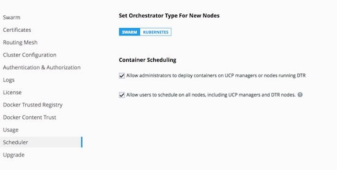
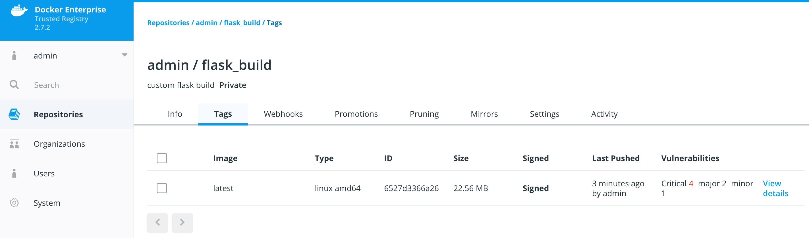

# Docker Enterprise Security Best Practices

## Introduction

Docker lives by “Secure by Default.” With Docker Enterprise (DE), the default configuration and policies provide a solid foundation for a secure environment. However, they can easily be changed to meet the specific needs of any organization.

Docker focuses on three key areas of container security: *secure access*, *secure content*, and *secure platform*. This results in having isolation and containment features not only built into Docker Enterprise but also enabled out of the box. The attack surface area of the Linux kernel is reduced, the containment capabilities of the Docker daemon are improved, and admins build, share, and run safer applications.

## What You Will Learn

This document outlines the default security of Docker Enterprise as well as best practices for further securing Universal Control Plane and Docker Trusted Registry. New features introduced in Docker Enterprise 3.0 such as Image Mirroring and Kubernetes are also explored.

## Prerequisites

* Docker Enterprise 3.0 (UCP 3.2.0, DTR 2.7.0, Engine 19.03.0) and higher on a Linux host OS with kernel 3.10-0.957 or greater
* Become familiar with [Docker Concepts from the Docker docs](https://docs.docker.com/engine/docker-overview/)

## Abbreviations

The following abbreviations are used in this document:

* UCP = Universal Control Plane
* DTR = Docker Trusted Registry
* RBAC = Role Based Access Control
* CA = Certificate Authority
* EE = Docker Enterprise Edition
* HA = High Availability
* BOM = Bill of Materials
* CLI = Command Line Interface
* CI = Continuous Integration

## TL;DR

* Enable Selinux
* Enable FIPS - OS and Engine
* UCP/DTR is secure by default
* Always stay updated
* Enable Network Isolation with Network Security Policy for K8s.
* Establish a Secure Supply Chain

## Engine and Node Security

There are already several resources that cover the basics of Docker Engine security.

* [Docker Security Documentation](https://docs.docker.com/engine/security/security/) covers the fundamentals, such as namespaces and control groups, the attack surface of the Docker daemon, and other kernel security features.
* [CIS Docker Community Edition Benchmark](https://www.cisecurity.org/benchmark/docker/) covers the various security-related options in Docker Engine. Useful with Docker Enterprise.
* [Docker Bench Security](https://github.com/docker/docker-bench-security) is a script that audits your configuration of Docker Engine against the CIS Benchmark.

### Choice of Operating Systems

Docker Enterprise Engine 19.03 (a required prerequisite for installing UCP and included with Docker Enterprise) is supported on the following host operating systems:

* RHEL/CentOS/Oracle Linux 7.6 or greater (YUM-based systems)
* Ubuntu 16.04, and 18.04 LTS
* SUSE Linux Enterprise 12sp4, and 15

For other versions, check out the [official Docker support matrix](https://success.docker.com/article/compatibility-matrix).

To take advantage of built-in security configurations and policies, run the latest version of Docker Enterprise Engine. Also, ensure that the operating system is updated with all available patches. It is highly recommended to remove as much unnecessary software as possible to decrease attack surface within the environment.

### Enable FIPS Mode

The Federal Information Processing Standards (FIPS) is a set of publications developed and maintained by the National Institute of Standards and Technology (NIST), a United States federal agency. These publications define the security criteria required for government computers and telecommunication systems.

According to NIST, FIPS 140-2 “specifies the security requirements that will be satisfied by a cryptographic module used within a security system protecting sensitive but unclassified information.”

More information can be found at [https://www.nist.gov/...](https://www.nist.gov/publications/security-requirements-cryptographic-modules-includes-change-notices-1232002?pub_id=902003)

#### Enable FIPS on RHEL/Centos

This probably will require a reboot.

```bash
sed -i 's/GRUB_CMDLINE_LINUX="/GRUB_CMDLINE_LINUX="fips=1 /g' /etc/default/grub
grub2-mkconfig -o /boot/grub2/grub.cfg
reboot
```

#### Enable FIPS in the Docker Engine

Simply add a systmed file.

```bash
mkdir -p /etc/systemd/system/docker.service.d 2>&1; echo -e "[Service]\n  Environment=\"DOCKER_FIPS=1\"" > /etc/systemd/system/docker.service.d/fips-module.conf; systemctl daemon-reload; systemctl restart docker
```

### Limit Root Access to Node

Docker Enterprise uses a completely separate authentication backend from the host, providing a clear separation of duties. Docker Enterprise can leverage an existing LDAP/AD infrastructure for authentication. It even utilizes [RBAC Labels](#clusterrole-basedaccesscontrol) to control access to objects like images and running containers, meaning teams of users can be given full access to running containers. With this access, users can watch the logs and execute a shell inside the running container without needing to ever log into the host. Limiting the number of users that have access to the host reduces the attack surface.

### Remote Access to Daemon

Do not enable the remote daemon socket. If you must open it for Engine, then ALWAYS secure the docker with certificates.

When using Universal Control Plane, you should not open the daemon socket. If you must, be sure to review the [instructions for securing the daemon socket](https://docs.docker.com/engine/security/https/).

### Privileged Containers

Avoid running privileged containers if at all possible. Running a container privileged gives the container access to ALL the host namespaces (i.e. net, pid, and others). This gives full control of the host to the container. Keep your infrastructure secure by keeping the container and host authentication separate.

### Container UID Management

By default the user inside the container is root. Using a defense in depth model, it is recommended that not all containers run as root. An easy way to mitigate this is to use the `--user` declaration at run time. The container runs as the specified user, essentially removing root access.

Also keep in mind that the UID/GID combination for a file inside a container is the same outside of the container. In the following example, a container is running with a UID of 10000 and GID of 10000. If the user touches a file such as `/tmp/secret_file`, on a BIND-mounted directory, the UID/GID of the file is the same both inside and outside of the container as shown:

```bash
root @ ~  docker run --rm -it -v /tmp:/tmp --user 10000:10000 alpine sh
/ $ whoami
whoami: unknown uid 10000
/ $ touch /tmp/secret_file
/ $ ls -asl /tmp/secret_file
     0 -rw-r--r--    1 10000    10000            0 Jan 26 13:48 /tmp/secret_file
/ $ exit
root @ ~  ls -asl /tmp/secret_file
0 -rw-r--r-- 1 10000 10000 0 Jan 26 08:48 /tmp/secret_file
```

Developers should use `root` as little as possible inside the container. Developers should create their app containers with the [`USER`](https://docs.docker.com/engine/reference/builder/#user) declaration in their Dockerfiles.

### Seccomp

> **Note:** Seccomp for Docker Enterprise Engine is available starting with RHEL/CentOS 7 and SLES 12.

Seccomp (short for **Secure Computing Mode**) is a security feature of the Linux kernel, used to restrict the syscalls available to a given process.  This facility has been in the kernel in various forms since 2.6.12 and has been available in Docker Engine since 1.10.  The current implementation in Docker Engine provides a default set of restricted syscalls and also allows syscalls to be filtered via either a whitelist or a blacklist on a per-container basis (i.e. different filters can be applied to different containers running in the same Engine).  Seccomp profiles are applied at container creation time and cannot be altered for running containers.

Out of the box, Docker comes with a default Seccomp profile that works extremely well for the vast majority of use cases.  In general, applying custom profiles is not recommended unless absolutely necessary.  More information about building custom profiles and applying them can be found in the [Docker Seccomp docs](https://docs.docker.com/engine/security/seccomp/).

To check if your kernel supports seccomp:

```bash
cat /boot/config-`uname -r` | grep CONFIG_SECCOMP=
```

Look for the following in the output:

```bash
CONFIG_SECCOMP=y
```

### AppArmor / SELinux

[AppArmor](https://docs.docker.com/engine/security/apparmor/) and [SELinux](https://selinuxproject.org) are security modules similar to Seccomp in their use of profiles, however they differ in how those profiles are executed. The profile languages used by AppArmor and SELinux are different, with AppArmor available for Debian-based distributions such as Debian and Ubuntu, and SELinux available on Fedora/RHEL/CentOS/Oracle Linux.

Rather than a simple list of system calls and arguments, both allow for defining actors (generally processes), actions (reading files, network operations), and targets (files, IPs, protocols, etc.). Both are Linux kernel security modules, and both support mandatory access controls (MAC).

They need to be enabled on the host, while SELinux can be enabled at the daemon level.

To enable SELinux in the Docker daemon, modify `/etc/docker/daemon.json` and add the following:

```json
{
  "selinux-enabled": true
}
```

To check if SELinux is enabled:

```bash
docker info --format '{{.SecurityOptions}}'
```

`selinux` should be in the output if it is enabled:

```bash
[name=seccomp,profile=default name=selinux name=fips]
```

AppArmor is not applied to the Docker daemon. Apparmor profiles need to be applied at container run time:

```bash
docker run \
  --interactive \
  --tty \
  --rm \
  --security-opt apparmor=docker-default \
  hello-world
```

Additional resources for installing and setting up AppArmor/SELinux include:

* [Techmint - Implementing Mandatory Access Control with SELinux or AppArmor in Linux](http://www.tecmint.com/mandatory-access-control-with-selinux-or-apparmor-linux/)

* [nixCraft - Linux Kernel Security (SELinux vs AppArmor vs Grsecurity)](https://www.cyberciti.biz/tips/selinux-vs-apparmor-vs-grsecurity.html)

Bottom line is that it is always recommended to use AppArmor or SELinux for their supported operating systems.

### Runtime Privilege and Linux Capabilities — Advanced Tooling

> *Starting with kernel 2.2, Linux divides the privileges traditionally associated with superuser into distinct units, known as capabilities, which can be independently enabled and disabled.*  — [Capabilities man page](http://man7.org/linux/man-pages/man7/capabilities.7.html)

Linux capabilities are an even more granular way of reducing surface area. Docker Engine has a default list of capabilities that are kept for newly-created containers, and by using the `--cap-drop` option for `docker run`, users can exclude additional capabilities from being used by processes inside the container on a capability-by-capability basis. All privileges can be dropped with the `--user` option.

Likewise, capabilities that are, by default, not granted to new containers can be added with the `--cap-add` option. This is discouraged unless absolutely necessary, and using `--cap-add=ALL` is highly discouraged.

More details can be found in the [Docker Run Reference](https://docs.docker.com/engine/reference/run/#/runtime-privilege-and-linux-capabilities).

### Controls from the CIS Benchmark

There are many good practices that should be applied from the [CIS Docker Community Edition Benchmark v1.2.0](https://www.cisecurity.org/benchmark/docker/). Please keep in mind that the Benchmarks are written for a single engine only. Understanding that some of the controls may not be applicable to Docker Enterprise. Lets look at some good ones for Docker Enterprise. To apply these controls, edit the Engine settings. Editing the Engine setting in `/etc/docker/daemon.json` is the best choice for most of these controls. Refer to the [daemon.json guide](https://docs.docker.com/engine/reference/commandline/dockerd/#/daemon-configuration-file) for details.

#### Ensure centralized and remote logging is configured — CIS CE Benchmark v1.2.0 : Section 2.12

Having a central location for all Engine and container logs is recommended. This provides "off-node" access to all the logs, empowering developers without having to grant them SSH access.

To enable centralized logging, modify `/etc/docker/daemon.json` and add the following:

```json
{
  "log-level": "syslog",
  "log-opts": {syslog-address=tcp://192.x.x.x}
}
```

Then restart the daemon:

```bash
sudo systemctl restart docker
```

#### Enable Content Trust — CIS CE Benchmark v1.2.0 : Section 4.5

Content Trust is the cryptographic guarantee that the image pulled is the correct image. Content Trust is enabled by the [Notary project](https://github.com/theupdateframework/notary), a part of the Cloud Native Computing Foundation (CNCF). [Signing images with Notary is discussed](https://success.docker.com/article/security-best-practices#contenttrustandimagesigningwithdockertrust) later in this document.

When transferring data amongst networked systems, trust is a central concern. When communicating over an un-trusted medium such as the Internet, it is critical to ensure the integrity and the publisher of all data involved in operating a system. Docker Engine is used to push and pull images (data) to a public or private registry. Content Trust provides the ability to verify both the integrity and the publisher of all data received from a registry over any channel. Content Trust is available on Docker Hub or DTR 2.1.0 and higher. To enable it, add the following shell variable:

```bash
export DOCKER_CONTENT_TRUST=1
```

#### Audit with Docker Bench

[Docker Bench Security](https://store.docker.com/community/./images/docker/docker-bench-security) is a script that checks for dozens of common best practices around deploying Docker containers in production. Docker Bench Security is designed for auditing a single node deployment and not a SWARM cluster. The tests are all automated and are inspired by the [CIS Docker  Benchmark v1.1.0](CIS_Docker_Benchmark_v1.2.0.pdf ).

Here is how to run it :

```bash
docker run -it --net host --pid host --userns host --cap-add audit_control \
    -e DOCKER_CONTENT_TRUST=$DOCKER_CONTENT_TRUST \
    -v /var/lib:/var/lib \
    -v /var/run/docker.sock:/var/run/docker.sock \
    -v /usr/lib/systemd:/usr/lib/systemd \
    -v /etc:/etc --label docker_bench_security \
    docker/docker-bench-security
```

Here is example output:


The output is straightforward, providing a status message, CIS Benchmark Control number, and description fields. Pay special attention to the `[WARN]` messages, and `1 - Host Configuration` section. Also, keep in mind that while Docker Bench is designed to audit Docker Engine, it is not intended for auditing the setup of Universal Control Plane (UCP) and Docker Trusted Registry (DTR). There are a few controls that, when enabled, break UCP and DTR.

The following controls are not needed because they affect the operation of UCP/DTR:

| Control | Description | Impact |
|---|---|---|
| 2.1 | Restrict network traffic between containers | Needed for container communication |
| 2.6 | Configure TLS authentication for Docker daemon | Should not be enabled as it is not needed |
| 2.8 | Enable user namespace support | Currently not supported with UCP/DTR |
| 2.15 | Disable Userland Proxy | Disabling the proxy affects how the routing mesh works |
| 5.4 | Ensure privileged containers are not used | UCP requires privileged contianers |

## Windows Engine and Node Security

Beginning with Docker Engine 17.06, Docker Enterprise includes native Windows Server support. Docker Enterprise may be installed on a Windows Server node and then joined into a cluster managed by Universal Control Plane (UCP). Currently, only Windows worker nodes are supported, with manager nodes being deployed on Linux.

A UCP cluster with mixed worker nodes provides the capability to manage both Linux-based and Windows-based workloads within the same orchestration framework. Additionally, while Linux can only run containers with the traditional `process` isolation mode, Windows Server includes a second `hyperV` isolation mode. This mode encapsulates Docker containers with a slim Hyper-V virtual machine, providing additional isolation and security for the workload.

Some of the advantages of Windows worker nodes include:

* Eliminates conflicts between different versions of IIS/.NET to coexist on a single system with container isolation

* Works with Hyper-V virtualization

* Takes advantage of new base images like Windows Server Core and Nano Server

* Provides a consistent Docker user experience — use the same commands as Docker for Linux environments

* Adds isolation properties with Hyper V containers selected at runtime

For more information about installing Docker Enterprise on Windows Server, follow the [documentation](https://docs.docker.com/engine/installation/windows/docker-ee/).

## Universal Control Plane (UCP) Security

This section will cover Docker Universal Control Plane (UCP). UCP follows the same default posture of "Secure by Default". For example UCP out of the box delivers with two Certificate Authorities (CA) with Mutual TLS. The two CAs set up by UCP include:

* The first CA is used for ALL internal communication between managers and workers

* The second CA is for the end user communication.

Bifurcating the two communication paths is vital to keeping data traffic segregated, while Mututal TLS enables both the client and service to verify each others' identify. While complex to setup in other systems, the use of Mutual TLS is automatically configured between the manager and worker nodes by UCP.

Worker nodes are unprivileged, meaning they do not have access to the cluster state or secrets. When adding nodes to the UCP cluster, a join token must be used. The token itself incorporates the checksum of the CA cert so the new node can verify that it is communicating with the proper cluster.


### Kubernetes


The same "Secure by Default" approach is applied by Docker Enterprise to the built-in Kubernetes orchestrator. For reference please review external guidance on security from [kubernetes-security.info](https://kubernetes-security.info/). All the recommendations have already been applied. From a security point of view this is the best of both worlds, as Docker Enterprise provides user authentication and RBAC on top of Kubernetes. To ensure the Kubernetes orchestrator follows all the security best practices, UCP utilizes TLS for the Kubernetes API port. When combined with UCP's authentication model, this allows the same client bundle to talk to the Swarm or Kubernetes API.

For the configuration of Kubernetes, it is recommended that you follow the [CIS Kubernetes Benchmark](https://www.cisecurity.org/benchmark/kubernetes/).

In order to deploy Kubernetes within Docker Enterprise, the nodes need to be setup and configured. While a node may be configured in "Mixed Mode" to concurrently participate in both Swarm and Kubernetes orchestrators, it is advised to specify a single orchestrator. This avoids an issue where each orchestrator tries to control the containers on that node without knowledge of the resources used by the other orchestrator. Manager nodes are the exception, operating in Mixed Mode to ensure all components for both orchestrators are highly available.


To set a node's orchestrator, navigate to **Shared Resources** -> **Nodes** -> select the node you want to change. Next select the **Configure** -> **Details**. From there select **KUBERNETES** and save. Notice the warning that all the Swarm workloads will be evicted.


In addition to setting individual nodes for Kubernetes. UCP allows for all new nodes to be set to a specific orchestrator.
To set the default orchestrator for new nodes navigate to **Admin Settings** -> **Scheduler**, select **Kubernetes**, and save.



#### Pod Security Policy

Pod Security Policies (PSPs) are cluster-level resources which are enabled by default in Docker Universal Control Plane (UCP) 3.2. See Pod Security Policy for an explanation of this Kubernetes concept. [Kubernetes Docs - Pod Security Policy](https://kubernetes.io/docs/concepts/policy/pod-security-policy/) has more information.

There are two default PSPs in UCP: a privileged policy and an unprivileged policy. Administrators of the cluster can enforce additional policies and apply them to users and teams for further control of what runs in the Kubernetes cluster. This guide describes the two default policies, and provides two example use cases for custom policies.

To interact with PSPs, a user will need to be granted access to the PodSecurityPolicy object in Kubernetes RBAC. If the user is a UCP Admin, then the user can already manipulate PSPs. A normal user can interact with policies if a UCP admin creates the following ClusterRole and ClusterRoleBinding:

```bash
$ cat <<EOF | kubectl create -f -
apiVersion: rbac.authorization.k8s.io/v1
kind: ClusterRole
metadata:
  name: psp-admin
rules:
- apiGroups:
  - extensions
  resources:
  - podsecuritypolicies
  verbs:
  - create
  - delete
  - get
  - list
  - patch
  - update
EOF

$ cat <<EOF | kubectl create -f -
apiVersion: rbac.authorization.k8s.io/v1
kind: ClusterRoleBinding
metadata:
  name: psp-admin:$USER
roleRef:
  kind: ClusterRole
  name: psp-admin
  apiGroup: rbac.authorization.k8s.io
subjects:
- kind: User
  name: $USER
EOF
```

By default, there are two policies defined within UCP, privileged and unprivileged. Additionally, there is a ClusterRoleBinding that gives every single user access to the privileged policy. This is for backward compatibility after an upgrade. By default, any user can create any pod.

More information can be found at [docs.docker.com/ee/ucp/kubernetes/pod-security-policies/](https://docs.docker.com/ee/ucp/kubernetes/pod-security-policies/)

#### Network Security Policy

Network Security Policy (NSP) is a great way to isolate pods from a network level. Here is an example for isolating network traffic to each namespace.

```yaml
# Network Policy
# Deny All Network Policy for the Namespace
kind: NetworkPolicy
apiVersion: networking.k8s.io/v1
metadata:
  name: default-deny
spec:
  podSelector:
    matchLabels: {}
---
# Only accept traffic from all local pods in the namespace
kind: NetworkPolicy
apiVersion: networking.k8s.io/v1
metadata:
  name: allow-local-namespace-pods
spec:
  podSelector:
    matchLabels:
  ingress:
  - from:
    - podSelector: {}
---
# Allow ingress
kind: NetworkPolicy
apiVersion: networking.k8s.io/v1
metadata:
  name: allow-infra-traffic-to-namespace
spec:
  podSelector:
    matchLabels: {}
  ingress:
  - from:
    - namespaceSelector:
        matchLabels:
          name: ingress-nginx
```

Ideally, limiting all network traffic to the namespace and ingress is a great way to decrease the network surface area. [Kubernetes Docs - Network Security Policy](https://kubernetes.io/docs/concepts/services-networking/network-policies/) has more information.

#### Verification with Kube-Hunter

Validation is always great in any system. [Aqua](https://www.aquasec.com/) has opensource a tooled called [kube-hunter](https://github.com/aquasecurity/kube-hunter). Kube-hunter is good tool for scanning clusters to validate the level of security. Here is the output of running kube-hunter against an install of Docker Enterprise 3.0 (UCP 3.2.1, DTR 2.7.2, Engine 19.03.2).

```bash
$ docker run -it --rm --network host aquasec/kube-hunter --remote ucp.dockr.life
~ Started
~ Discovering Open Kubernetes Services...
|
| Kubelet API:
|   type: open service
|   service: Kubelet API
|_  location: ucp.dockr.life:10250
|
| Unrecognized K8s API:
|   type: open service
|   service: Unrecognized K8s API
|_  location: ucp.dockr.life:6443

----------

Nodes
+-------------+----------------+
| TYPE        | LOCATION       |
+-------------+----------------+
| Node/Master | ucp.dockr.life |
+-------------+----------------+

Detected Services
+----------------------+----------------------+----------------------+
| SERVICE              | LOCATION             | DESCRIPTION          |
+----------------------+----------------------+----------------------+
| Unrecognized K8s API | ucp.dockr.life:6443  | A Kubernetes API     |
|                      |                      | service              |
+----------------------+----------------------+----------------------+
| Kubelet API          | ucp.dockr.life:10250 | The Kubelet is the   |
|                      |                      | main component in    |
|                      |                      | every Node, all pod  |
|                      |                      | operations goes      |
|                      |                      | through the kubelet  |
+----------------------+----------------------+----------------------+

No vulnerabilities were found
```

Validating the cluster is Secure by Default is a good thing.

### Networking

Networking is an important part of any Docker Enterprise deployment. Whether deploying to a public cloud infrastructure or to an on-premises datacenter, low latency between nodes is a must to ensure the distributed databases are able to keep quorum. Latency requirements are published as part of the [UCP System Requirements](https://docs.docker.com/ee/ucp/admin/install/system-requirements/#timeout-settings).

Firewalls are generally avoided between the manager and worker nodes to minimize connectivity issues. When a software or hardware firewall is deployed between the nodes, the following ports need to be opened. Definitions for Scope:

* Internal - Inside the cluster
* External - External to the cluster, vlan, vpc, or subnet
* Self - Within the single node

| Hosts             | Port                    | Scope              | Purpose                                                                       |
|:------------------|:------------------------|:-------------------|:------------------------------------------------------------------------------|
| managers, workers | TCP 179                 | Internal           | Port for BGP peers, used for kubernetes networking                            |
| managers          | TCP 443 (configurable)  | External, Internal | Port for the UCP web UI and API                                               |
| managers          | TCP 2376 (configurable) | Internal           | Port for the Docker Swarm manager. Used for backwards compatibility           |
| managers          | TCP 2377 (configurable) | Internal           | Port for control communication between swarm nodes                            |
| managers, workers | UDP 4789                | Internal           | Port for overlay networking                                                   |
| managers          | TCP 6443 (configurable) | External, Internal | Port for Kubernetes API server                                                |
| managers, workers | TCP 6444                | Self               | Port for Kubernetes API reverse proxy                                         |
| managers, workers | TCP, UDP 7946           | Internal           | Port for gossip-based clustering                                              |
| managers, workers | TCP 10250               | Internal           | Port for Kubelet                                                              |
| managers, workers | TCP 12376               | Internal           | Port for a TLS authentication proxy that provides access to the Docker Engine |
| managers, workers | TCP 12378               | Self               | Port for Etcd reverse proxy                                                   |
| managers          | TCP 12379               | Internal           | Port for Etcd Control API                                                     |
| managers          | TCP 12380               | Internal           | Port for Etcd Peer API                                                        |
| managers          | TCP 12381               | Internal           | Port for the UCP cluster certificate authority                                |
| managers          | TCP 12382               | Internal           | Port for the UCP client certificate authority                                 |
| managers          | TCP 12383               | Internal           | Port for the authentication storage backend                                   |
| managers          | TCP 12384               | Internal           | Port for the authentication storage backend for replication across managers   |
| managers          | TCP 12385               | Internal           | Port for the authentication service API                                       |
| managers          | TCP 12386               | Internal           | Port for the authentication worker                                            |
| managers          | TCP 12387               | Internal           | Port for the metrics service                                                  |

### Authentication

Docker Enterprise features a single sign-on for the entire cluster, which is accomplished via shared authentication service for UCP and DTR. The single sign-on is provided out of the box with AuthN or via an externally-managed LDAP/AD authentication service. Both authentication backends provide the same level of control. When available, a corporate LDAP service can provide a smoother account experience for users. Refer to the [LDAP/AD configuration docs](https://docs.docker.com/datacenter/ucp/2.2/guides/admin/configure/external-auth/) and [Docker Enterprise Best Practices and Design Considerations](https://success.docker.com/Architecture/Docker_Reference_Architecture%3A_Docker_EE_Best_Practices_and_Design_Considerations) for instructions and best practices while configuring LDAP authentication.

To change the authentication to LDAP, go to **Admin -> Admin Settings -> Authentication & Authorization** in the UCP web interface.


### UCP External Certificates

Using external certificates is a recommended when integrating with a corporate environment. Using external, officially-signed certificates simplifies having to distribute internal Certificate Authority (CA) certificates. One best practice is to use the Certificate Authority for your organization. Reduce the number of certificates by adding multiple Subject Alternative Names (SANs) to a single certificate. This allows the certificate to be valid for multiple URLs. For example, you can set up a certificate for `ucp.example.com`, `dtr.example.com`, and all the underlying hostnames and IP addresses. One certificate/key pair makes deploying certs easier.

To add an external certificate, go to **Admin -> Admin Settings -> Certificates** in the UCP web interface and add the CA, Cert, and Key.


More detailed [instructions for adding external certificates](https://docs.docker.com/ee/ucp/admin/configure/use-your-own-tls-certificates/) are available in the Docker docs.

### Join Token Rotation

Depending on how the swarm cluster is built, it is possible to have the join token stored in an insecure location. To alleviate any concerns, join tokens can be rotated after the cluster is built. To rotate the keys, go to the **Admin -> Admin Settings -> Swarm** page, and click the **Rotate** button.


### Node Certificate Expiration

Universal Control Plane's management plane uses a private CA and certificates for all internal communication. The client certificates are automatically rotated on a schedule, providing a strong method for reducing the effect of a compromised node. There is an option to reduce the default time interval of 90 days to a shorter interval, however shorter intervals do add stress to the UCP cluster. To adjust the certificate rotation schedule, go to **Admin -> Admin Settings -> Swarm** and scroll down.


### Client Bundles and PKI x509

As of Universal Control Plane 3.2.0 Public-Key Infrastructure ( PKI ) is now fully supported. For those not sure about PKI take a look at the [wikipedia entry](https://en.wikipedia.org/wiki/Public_key_infrastructure) page. Universal Control Plane makes it easy to create a client certificate bundle for use with the Docker client if you don't already have a PKI system. The client bundle allows end users to securely connect from a Docker Client to UCP via certificates when deploying workloads and administering the environment.

To enable PKI with UCP navigate to **Admin Settings** -> **Certificates**. Scroll down to Client CA. Paste in any and all Root Client CAs and Intermediates as needed.


Click Save.

To create a client bundle, log into UCP, and click the login name in the upper left. Then select **My Profile** -> **Client Bundles**.


Selecting **New Client Bundle** with create and download a zipped bundle. Inside the bundle are the files necessary for talking to the UCP cluster directly.

Navigate to the directory where you downloaded the user bundle, and unzip it.

```bash
unzip ucp-bundle-admin.zip
```

Then run the `env.sh` script:

```bash
eval $(<env.sh)
```

On Windows, the bundle may be imported with PowerShell:

```powershell
Import-Module .\env.ps1
```

Verify the changes:

```bash
docker info
```

The `env.sh` script updates the `DOCKER_HOST` environment variable to make your local Docker CLI communicate with UCP. It also updates the `DOCKER_CERT_PATH` environment variable to use the client certificates that are included in the client bundle you downloaded.

After setting up a client bundle, the Docker CLI client will include the client certificates as part of the request to the Docker engine. The Docker CLI can now be used to create services, networks, volumes, and other resources on a swarm managed by UCP. The Kubernetes CLI tool, `kubectl`, will also be configured for programmatic access to the Kubernetes API within UCP.

To stop talking to the UCP cluster, restart the terminal or run the following command:

```bash
unset DOCKER_HOST DOCKER_TLS_VERIFY DOCKER_CERT_PATH
```

Run `docker info` to verify that the Docker CLI is communicating with the local daemon.

To import your own existing certificate. Please make sure the Client Certificate has been configured.


### Cluster Role-Based Access Control

The [Access Control model](https://docs.docker.com/ee/ucp/authorization/) within Docker Enterprise provides an extremely fine-grained control of what resources users can access within a cluster. Use of role based access controls (RBAC) is **highly** recommended for a secure cluster. Security principles of _least privilege_ dictate the use of access control to limit access to resources whenever possible.

#### Access Control Policy

Docker Enterprise Access Control is a policy-based model that uses access control lists (ACLs) called **grants** to dictate access between users and cluster resources. A grant ties together _who_, has permission for _which actions_, against _what resource_. They are a flexible way of implementing access control for complex scenarios without incurring high management overhead for the system administrators.

As shown below, a grant is made up of a *subject* (who), *role* (which permissions), and a *collection* (what resources).


> **Note:** It is the UCP administrators' responsibility to create and manage the grants, subjects, roles, and collections.

#### Subjects

A subject represents a user, team, or organization. A subject is granted a role for a collection of resources. These groups of users are the same across UCP and DTR making RBAC management across the entire software pipeline uniform.

|  |  |
|---|---|
| **User** | A single user or system account that an authentication backend (AD/LDAP) has validated. |
| **Team** | A group of users that share a set of permissions defined in the team itself. A team exists only as part of an organization, and all team members are members of the organization. A team can exist in one organization only. Assign users to one or more teams and one or more organizations. |
| **Organization** | The largest organizational unit in Docker Enterprise. Organizations group together teams to provide broader scope to apply access policy against. |

#### Roles and Permissions

A role is a set of permitted API operations that may be assigned to a specific subject and collection by using a grant. Roles define what operations can be done against cluster resources. An organization will likely use several different kinds of roles to give the right kind of access. A given team or user may have different roles provided to them depending on what resource they are accessing. There are default roles provided by UCP, and there is also the ability to build custom roles.

##### Custom Roles

Docker Enterprise defines granular roles down to the Docker API level to match unique requirements that an organization may have. [Define roles with authorized API operations](https://docs.docker.com/ee/ucp/authorization/define-roles/) has a full list of the operations that can be used to build new roles.

For example, a custom role called _developer_ could be created to allow developers to view and retrieve logs from their own containers that are deployed in production. A developer cannot affect the container lifecycle in any way but can gather enough information about the state of the application to troubleshoot application issues.


##### Built-In Roles

UCP also provides default roles that are pre-created. These are common role types that can be used to ease the burden of creating custom roles.

| Built-In Role   | Description |
|:---------------------|:-----------------------------------------------------------------------------------------------------------------------------------------------------------------------------------------------------------------------------------------------------------------------------------------------------------------------------------------------------------------------------------|
| `None`               | The user has no access to swarm resources. This maps to the `No Access` role in UCP 2.1.x. |
| `View Only`          | The user can view resources like services, volumes, and networks but can't create them. |
| `Restricted Control` | The user can view and edit volumes, networks, and images but can't run a service or container in a way that might affect the node where it's running. The user can't mount a node directory and can't `exec` into containers. Also, the user can't run containers in privileged mode or with additional kernel capabilities.  |
| `Scheduler`          | The user can view nodes and schedule workloads on them. Worker nodes and manager nodes are affected by `Scheduler` grants. Having `Scheduler` access doesn't allow the user to view workloads on these nodes. They need the appropriate resource permissions, like `Container View`. By default, all users get a grant with the `Scheduler` role against the `/Shared` collection. |
| `Full Control`       | The user can view and edit volumes, networks, and images. They can create containers without any restriction but can't see other users' containers. |

#### Collections

Docker Enterprise enables controlling access to swarm resources by using *collections*. A collection is a grouping of swarm cluster resources that you access by specifying a directory-like path.  Before grants can be implemented, collections need to be designed to group resources in a way that makes sense for an organization.

The following example shows the potential access policy of an organization. Consider an organization with two application teams, Mobile and Payments, that share cluster hardware resources, but still need to segregate access to the applications. Collections should be designed to map to the organizational structure desired, in this case the two application teams.


> **Note:** Permissions to a given collection are inherited by all children of that collection.

Collections are implemented in UCP through the use of Docker labels. All resources within a given collection are labeled with the collection, `/production/mobile` for instance.

Collections are flexible security tools because they are hierarchical. For instance, an organization may have multiple levels of access. This might neccessitate a collection architecture like the following:

```bash
├── production
│   ├── database
│   ├── mobile
│   └── payments
│       ├── restricted
│       └── front-end
└── staging
    ├── database
    ├── mobile
    └── payments
        ├── restricted
        └── front-end
```

To create a child collection, navigate into the parent collection. Then create the child.


To add objects to collections, leverage labels. When deploying a stack make sure all objects are "labeled." Here is a good example of a few labels :

* Add an object to the `/production` collection: `com.docker.ucp.access.label: "/production"`
* Add an object to the `/production/mobile` collection: `com.docker.ucp.access.label: "/production/mobile"`

Adding nodes to a collection takes a little more care. Please follow the [documentation](https://docs.docker.com/ee/ucp/authorization/group-resources/) for isolating nodes to specific teams. Isolating nodes is a great way to provide more separation for multi-tenant clusters.

#### Grant Composition

When subjects, collections, and roles are setup, grants are created to map all of these objects together into a full access control policy. The following grant is one of many that might be created:


Together, the grants clearly define which users have access to which resources. This is a list of some of the default grants in UCP that exist to provide an admin the appropriate access to UCP and DTR infrastructure.


### Secrets

A Docker secret is a blob of sensitive data that should not be transmitted over a network, such as:

* Usernames and passwords

* TLS certificates and keys

* SSH keys

* Other important data such as the name of a database or internal server

* Generic strings or binary content (up to 500 kb in size)

Such sensitive data is often stored unencrypted in a Dockerfile or stored in an application's source code. It is recommended to transition such data to Docker secrets to centrally manage this data and securely transmit it only to those containers that require access. Secrets follow a Least Privileged Distribution model, and are encrypted at rest and in transit in a Docker swarm. A given secret is only accessible to those services which have been granted explicit access and only while those service tasks are running.

> **Note**: Docker secrets are only available to swarm services, not to standalone containers. To use this feature, consider adapting the container to run as a Docker service with a scale of 1.

Another use case for using secrets is to provide a layer of abstraction between the container and a set of credentials. Consider a scenario where separate development, test, and production environments are used for an application. Each of these environments can have different credentials, stored in the development, test, and production swarms with the same secret name. The containers only need to know the name of the secret to function in all three environments.

When a secret is added to the swarm, Docker sends the secret to the swarm manager over a mutual TLS connection. The secret is stored in the Raft log, which is encrypted. The entire Raft log is replicated across the other managers, ensuring the same high availability guarantees for secrets as for the rest of the swarm management data.


When a newly-created or running service is granted access to a secret, the decrypted secret is mounted into the container in an in-memory filesystem at `/run/secrets/<secret_name>`. It is possible to update a service to grant it access to additional secrets or revoke its access to a given secret at any time.

  > Since Windows Server does not include a similar in-memory disk mechanism, the secret will be written to its disk at `C:\ProgramData\Docker\secrets`. For this reason it is recommended to use a disk encryption technique such as BitLocker

A node only has access to (encrypted) secrets if the node is a swarm manager or if it is running service tasks which have been granted access to the secret. When a container task stops running, the decrypted secrets shared to it are unmounted from the in-memory filesystem for that container and flushed from the node's memory.

If a node loses connectivity to the swarm while it is running a task container with access to a secret, the task container still has access to its secrets but cannot receive updates until the node reconnects to the swarm.

Docker Enterprise's strong RBAC system can tie _secrets_ into it with the exact same labels demonstrated before, meaning you should always limit the scope of each secret to a specific team. If there are NO labels applied, the default label is the owner.

For example, TLS certificates can be added as secrets. Using the same RBAC example teams as previously mentioned, the following example adds `ca.pem`, `cert.pub`, and `cert.pem` to the secrets vault. Notice the use of the label `com.docker.ucp.access.label=/prod`. This is important for enforcing the RBAC rules. Also note the use of the team name in the naming of the secret. For another idea for updating or rolling back secrets, consider adding a version number or date to the secret name. This is made easier by the ability to control the mount point of the secret within a given container. This also prevents teams from trying to use the same secret name. Secrets can be found under the **Swarm** menu. The following adds the CA's public certificate in pem format as a secret named `orcabank_prod_mobile.ca.pem.v1`.


Next, set the collection the secret is in. Using the same example from above, select the `/prod` collection.


Secrets are only available to services. The following creates an `nginx` service. The service and the secret MUST be in the same collection.  Again, apply the collection through the use of labels. If they don't match, UCP won't allow you to deploy.  The next example deploys a service that can be used as a secret:


The important part is on the **Environment** tab. Click the **+ Use a secret**. Use the advanced settings to configure the UID/GID and file mode for the secret when it is mounted. Binaries and tarballs can be added as secrets, with a file size up to 500KB. Be sure to click **Confirm** to add the secret.

When using the CLI, the option, `--secret source=,target=,mode=` needs to be added to the `docker service create` command as follows:

```bash
$ docker service create \
  --label com.docker.ucp.access.label=/prod \
  --name nginx \
  --publish 443 \
  --secret source=orcabank_prod_mobile.ca.pem.v1,target=ca.pem \
  --secret source=orcabank_prod_mobile.cert.pub.v1,target=cert.pub \
  --secret source=orcabank_prod_mobile.cert.pem.v1,target=cert.pem \
  nginx
```

Notice that the secrets are mounted to `/run/secrets/`. Because of labels in this example, only administrators and the crm team have access to this container and its secrets.


Changing secrets is as easy as removing the current version and creating it again. *Be sure the labels on the new secret are correct.*

### Logging

Universal Control Plane (UCP) is deployed as a containerized application, automatically using the Docker Engine's logging configuration.

### OSCAL - Experimental

As of Docker Enterprise 3.0 Universal Control Plane is shipping with [Open Security Controls Assessment Language (OSCAL)](https://pages.nist.gov/OSCAL/) as an experimental feature. The Open Security Controls Assessment Language (OSCAL) is a set of standardized XML- and JSON-based formats developed by the National Institute of Standards and Technology (NIST) for reporting, implementing, and assessing system security controls. Docker Enterprise contains OSCAL integrations for automating attestation and reporting requirements of your container platform. Use the OSCAL integrations to automatically:

* Assess system compliance.
* Correct system configurations that have drifted and are non-compliant.
* Download Docker’s officially signed and maintained OSCAL-formatted attestation artifacts that describe how Docker’s products adhere to and can be configured to meet compliance standards and hardening benchmarks.

These OSCAL auditing and reporting capabilities are exposed via OSCAL API endpoints built into UCP and
enabled by default. Capabilities also include the majority of the recommendations in the CIS Kubernetes Benchmark, along with a subset of the CIS Docker Benchmark checks that are currently performed by the external. Universal Control Plane ships with a well documented api.


#### Get Catalog Version

```bash
$ token=$(curl -sk -d '{"username":"admin","password":"<PASSWORD>"}' https://<UCP_URL>/auth/login | jq -r .auth_token)
$ curl -skX GET "https://<UCP_URL>/oscal/catalogs" -H "Authorization: Bearer $token" -H "accept: application/json" | jq .
[
  {
    "id": "NIST_800-53",
    "modelVersion": "Revision 4",
    "title": "This NIST SP 800-53 database represents the security controls and associated assessment procedures defined in NIST SP 800-53 Revision 4 Recommended Security Controls for Federal Information Systems and Organizations",
    "declarations": {
      "href": "https://nvd.nist.gov/800-53"
    }
  }
]
```

#### Get Controls

Here is a truncated output from the list of controls.

```bash
$ token=$(curl -sk -d '{"username":"admin","password":"<PASSWORD>"}' https://<UCP_URL>/auth/login | jq -r .auth_token)
$ curl -skX GET "https://ucp.dockr.life/oscal/controls" -H "Authorization: Bearer $token" -H "accept: application/json"  | jq .
[
  {
    "title": "NIST SP800-53",
    "groups": [
      {
        "id": "Access Control",
        "controls": [
          {
            "id": "ac-2",
            "class": "SP800-53",
            "title": "Account Management",
            "subcontrols": [...
```

There is a lot more work to be done on displaying and auditing the individual controls. Please standby.

## DTR Security

Docker Trusted Registry continues the "Secure by Default" theme with two new strong features: *Image Signing* (via the Notary project) and *Image Scanning*. Additionally, DTR shares authentication with UCP, which simplifies setup and provides strong RBAC without any effort.

DTR stores metadata and layer data in two separate locations. The metadata is stored locally in a database that is shared between replicas. The layer data is stored in a configurable location.

### Public-Key Infrastructure (PKI) Integration

In order to take advantage of Public-Key Infrastructure (PKI) for `docker push` and `docker pull` DTR needs to be configured. Configuring DTR is from the command line.

```bash
docker run --rm -it docker/dtr:2.7.2 reconfigure --ucp-url ucp.dockr.life --ucp-username admin --ucp-password <PASSWORD> --enable-client-cert-auth --client-cert-auth-ca "$(cat < orig.ca.pem)" --ucp-insecure-tls
```

Similar to UCP the file should include all Root and Intermediate certificates. Once configured the client will still need to be configured.

#### PKI Push and Pull

To configure the docker daemon it is suggested to remove the `~/.docker/config.json` authentication file. This will ensure the client will only use PKI for authentication. Simply copy the certificate and key to `/etc/docker/certs.d/<FQDN>/`

Example:

```bash
[root@ddc-bdd1 ~]# ls -asl /etc/docker/certs.d/dtr.dockr.life/
total 12
0 drw-r--r--. 2 root root  69 Sep  9 16:32 .
0 drw-r--r--. 3 root root  28 Sep  9 12:05 ..
4 -rw-r--r--. 1 root root 741 Sep 28  2018 client.cert
4 -rw-------. 1 root root 227 Sep 28  2018 client.key
4 -rw-r--r--. 1 root root 725 Sep  9 12:05 dtr.dockr.life.crt
```

Once configured all `docker push` and `docker pull` commands will use the PKI certificates for authentication.

### DTR External Certificates

Similar to UCP, DTR can use either the default self-signed certificates, or fully-signed company certificates sourced from an existing corporate Certificate Authority (CA). To reduce the number of certificates, add multiple Subject Alternative Names (SANs) to a single certificate. This allows the certificate to be valid for multiple URLs. For example, when setting up a certificate for `ucp.example.com`, add SANs of `dtr.example.com` and all the underlying hostnames and IP addresses. Using this technique allows the same certificate to be used for both UCP and DTR.

External certificates are added to DTR by going to **System** -> **General** -> **Domain & proxies** -> **Show TLS Settings**.


For more instructions on adding external certificates, refer to the [Docker docs](https://docs.docker.com/datacenter/dtr/2.2/guides/admin/configure/use-your-own-tls-certificates/).

### Storage Backend

The choice of the storage backend for DTR has effects on both performance and security.  The choices include:

| Type | Pros | Cons |
| --- | --- | --- |
| Local Filesystem | Fast and Local. Pairs great with local block storage. | Requires bare metal or ephemeral volumes. NOT good for HA. |
| S3 | Great for HA and HTTPS communications. Several third party servers available. [Can be encrypted at rest.](http://docs.aws.amazon.com/AmazonS3/latest/dev/UsingEncryption.html) | Requires maintaining or paying for an external S3 compliant service. |
| Azure Blob Storage | Can be configured to act as local but have redundancy within Azure Storage. [Can be encrypted at rest.](https://docs.microsoft.com/en-us/azure/storage/common/storage-service-encryption) | Requires Azure cloud account. |
| Swift | Similar to S3 being an object store. | Requires OpenStack infrastructure for service. |
| Google Cloud Storage | Similar to S3 being an object store. [Can be encrypted at rest.](https://cloud.google.com/security/encryption-at-rest/) | Requires a Google Cloud account. |
| NFS | Easy to setup/integrate with existing infrastructure. | Slower due to network calls. |

To change the settings, go to **System** -> **Storage** in UCP.


Storage choice is highly influenced by where Docker Enterprise is deployed; place DTR's backend storage as close as possible to DTR itself. Always ensure that HTTPS (TLS) is being used. Also, consider how to backup DTR's images. When in doubt, use a secure object store, such as S3 or similar. Object stores provide the best balance between security and ease of use and also make it easy for highly available (HA) DTR setups.

### Garbage Collection

Garbage collection is an often-overlooked area from a security standpoint.  Old, out-of-date images may contain security flaws or exploitable vulnerabilities; removing unnecessary images is important.  Garbage collection is a feature that ensures that unreferenced images (and layers) are removed.

To scheduling the current Garbage Collection navigate to **System** -> **Garbage Collection**. The current best practices is to create a schedule for every Saturday or Sunday and **Until Done**. Click **Save & Start**.


### Organizations and Teams — RBAC

Since Universal Control Plane and Docker Trusted Registry utilize the same authentication backend, users are shared between the two. This simplifies user management since UCP 2.2 and DTR 2.3 organizations are now shared. That means DTR and UCP can manage the organizations and teams. Consider the differences between organizations and teams. Teams are nested underneath organizations. Teams allow for a finer grain control of access.

Here’s an overview of the permission levels available for organizations and users:

* **Anonymous users**: Search and pull public repositories.
* **Users**: Search and pull public repos. Create and manage their own repositories.
* **Team member**: Can do everything a user can do plus the permissions granted by the teams the user is a member of.
* **Team admin**: Can do everything a team member can do, and can also add members to the team.
* **Organization admin**: Can do everything a team admin can do, can create new teams, and add members to the organization.
* **Admin**: Can manage anything across UCP and DTR.

The following example creates an organization called `web`:


Once the organizations are created, add teams to the organization.


For example, an organization named `web`, a team named `prod`, and a repository named `web/awesome_app` were created. Permissions can now be applied to the images themselves.


This chart shows the different permission levels for a team against a repository:

| Repository Operation  | read | read-write | admin |
|:----------------------|:----:|:----------:|:-----:|
| View / browse         | x    | x          | x     |
| Pull                  | x    | x          | x     |
| Push                  |      | x          | x     |
| Delete tags           |      | x          | x     |
| Edit description      |      |            | x     |
| Set public or private |      |            | x     |
| Manage user access    |      |            | x     |
| Delete repository     |      |            |       |

It is important to limit the number of users that have access to images. Applying the permission levels correctly is important. This helps in creating a Secure Supply Chain.

### Content Trust and Image Signing with Docker Trust

Good News, as of Docker Engine 18.06 there is a `docker trust` command that will streamline the image signing process. The old is Notary. Notary is a tool for publishing and managing trusted collections of content. Publishers can digitally sign collections and consumers can verify integrity and origin of content. This ability is built on a straightforward key management and signing interface to create signed collections and configure trusted publishers.

Docker Content Trust/Notary provides a cryptographic signature for each image. The signature provides security so that the image requested is the image you get. Read [Notary's Architecture](https://docs.docker.com/notary/service_architecture/) to learn more about how Notary is secure. Since Docker Enterprise is "Secure by Default," Docker Trusted Registry comes with the Notary server out of the box.

In addition, Docker Content Trust allows for threshold signing and gating for the releases. Under this model, software is not released until all necessary parties (or a quorum) sign off. This can be enforced by requiring (and verifying) the needed signatures for an image. This policy ensures that the image has made it through the whole process: if someone tries to make it skip a step, the image will lack a necessary signature, thus preventing deployment of that image.

The following examples shows the basic usage of `docker trust`.

```bash
root @ ~  $ export DOCKER_CONTENT_TRUST_ROOT_PASSPHRASE="Pa22word" DOCKER_CONTENT_TRUST_REPOSITORY_PASSPHRASE="Pa22word"
root @ ~  $ docker trust sign dtr.dockr.life/admin/flask_build:latest
Created signer: admin
Finished initializing signed repository for dtr.dockr.life/admin/flask_build:latest
Signing and pushing trust data for local image dtr.dockr.life/admin/flask_build:latest, may overwrite remote trust data
The push refers to repository [dtr.dockr.life/admin/flask_build]
b5d3d38ba60e: Layer already exists
2560f291beda: Layer already exists
f4c509302c31: Layer already exists
256a7af3acb1: Layer already exists
latest: digest: sha256:6527d3366a26ba9c50024c9f2555c48ca8f364f2f8277df33cb9ad99444bd4bf size: 1156
Signing and pushing trust metadata
Successfully signed dtr.dockr.life/admin/flask_build:latest
root @ ~  $
```

The above does the following:

* First set the root chain signing passwords `export DOCKER_CONTENT_TRUST_ROOT_PASSPHRASE="Pa22word" DOCKER_CONTENT_TRUST_REPOSITORY_PASSPHRASE="Pa22word"`
* Second `docker trust sign`. That simple.

A successfully signed image has a green check mark in the DTR GUI.



With `docker trust` adding a signer has become much easier. See the example below.

```bash
root @ ~/pki  $ docker trust signer add --key cert.pem admin dtr.dockr.life/admin/flask_build
Adding signer "admin" to dtr.dockr.life/admin/flask_build...
Successfully added signer: admin to dtr.dockr.life/admin/flask_build
root @ ~/pki  $ docker trust key load --name admin key.pem
Loading key from "key.pem"...
Successfully imported key from key.pem
root @ ~/pki  $
```

#### Key Management

The Docker and Notary clients store state in its `trust_dir` directory, which is `~/.docker/trust` when enabling Docker Content Trust. This directory is where all the keys are stored. All the keys are encrypted at rest. It is VERY important to protect that directory with permissions. Keep in mind this also applies to `docker trust`.

The `root_keys` subdirectory within `private` stores root private keys, while `tuf_keys` stores targets, snapshots, and delegations private keys.

Interacting with the local keys requires the installation of the Notary client. Binaries can be found at [https://github.com/docker/notary/releases](https://github.com/docker/notary/releases). Here is a quick installation script:

```bash
root $ wget -O /usr/local/bin/notary https://github.com/theupdateframework/notary/releases/download/v0.6.0/notary-Linux-amd64
root $ chmod 755 /usr/local/bin/notary
```

At the same time, getting the notary client DTR's CA public key is also needed. Assuming Centos/Rhel :

```bash
root $ sudo curl -sk https://dtr.example.com/ca -o /etc/pki/ca-trust/source/anchors/dtr.example.com.crt; sudo update-ca-trust
```

It is easy to simplify the notary command with an alias.

```bash
root $ alias notary="notary -s https://dtr.example.com -d ~/.docker/trust --tlscacert /etc/pki/ca-trust/source/anchors/dtr.example.com.crt"
```

With the alias in place, run `notary key list` to show the local keys and where they are stored.

```bash
ROLE       GUN                          KEY ID                                                              LOCATION
----       ---                          ------                                                              --------
root                                    44d193b5954facdb5f21584537774b9732cfea91e5d7531075822c58f979cc93    /root/.docker/trust/private
targets    ...ullet.com/admin/alpine    2a0738c4f75e97d3a5bbd48d3e166da5f624ccb86899479ce2381d4e268834ee    /root/.docker/trust/private
```

To make the keys more secure it is recommended to always store the `root_keys` offline, meaning, not on the machine used to sign the images. If that machine were to get compromised, then an unauthorized person would have everything needed to sign "bad" images. Yubikey is a really good method for storing keys offline.

##### Use a Yubikey

Notary can be used with a hardware token storage device called a [Yubikey](https://www.yubico.com/products/yubikey-hardware/). The Yubikey must be prioritized to store root keys and requires user touch-input for signing. This creates a two-factor authentication for signing images. Note that Yubikey support is included with the Docker Engine 1.11 client for use with Docker Content Trust. The specific use is to have all of your developers use Yubikeys with their workstations. Get more information about Yubikeys from the [Docker docs](https://docs.docker.com/notary/advanced_usage/#/use-a-yubikey).

##### Signing with Jenkins

When teams get large, it becomes harder to manage all the developer keys. One method for reducing the management load is to not let developers sign images. Using Jenkins to sign all the images that are destined for production eliminates most of the key management. The keys on the Jenkins server still need to be protected and backed up.

The first step is to create a user account for your CI system. For example, assume Jenkins is the CI system. As an admin user, navigate to **Organizations** and select **New organization**. Assume it is called "ci". Next, add a Jenkins user by navigating into the organization and selecting **Add User**. Create a user with the name `jenkins` and set a strong password. This will create a new user and add the user to the "ci" organization. Next, give the Jenkins user "Org Admin" status so the user is able to manage the repositories under the "ci" organization. Also avigate to UCP's **User Management** and create a team under the "ci" organization. Assume this team is named "jenkins".


Now that the team is setup, turn on the policy enforcement. Navigate in UCP to **Admin Settings** and then the **Docker Content Trust** subsection. Select the "**Run Only Signed Images**" checkbox to enable Docker Content Trust. In the select box that appears, select the "jenkins" team that was just created. Save the settings.

This policy requires every image that is referenced in a `docker pull`, `docker run`, or `docker service create` be signed by a key corresponding to a member of the "jenkins" team. In this case, the only member is the `jenkins` user.


The signing policy implementation uses the certificates issued in user client bundles to connect a signature to a user. Using an incognito browser window (or otherwise), log into the `jenkins` user account created earlier. Download a client bundle for this user. It is also recommended to change the description associated with the public key stored in UCP such that it can be identify in the future as the key being used for signing.

Please note each time a user retrieves a new client bundle, a new keypair is generated. It is therefore necessary to keep track of a specific bundle that a user chooses to designate as the user's signing bundle.

Once the client bundle has been decompressed, the only two files needed for the purpose of signing are `cert.pem` and `key.pem`. These represent the public and private parts of the user’s signing identity respectively. Load the `key.pem` file onto the Jenkins servers, and use `cert.pem` to create delegations for the `jenkins` user in the Trusted Collection.

On the Jenkins server, use `docker trust` to load keys and sign images as in the examples above. The Jenkins server is now prepared to sign images.

### Image Scanning

Starting with version 2.3.0, DTR includes on-premises image scanning. The on-prem scanning engine within DTR scans images against the [CVE Database](https://cve.mitre.org/). First, the scanner performs a binary scan on each layer of the image, identifies the software components in each layer, and indexes the SHA of each component. This binary scan evaluates the components on a bit-by-bit basis, so vulnerable components are discovered regardless of filename, whether or not they're included on a distribution manifest or in a package manager, whether they are statically or dynamically linked, or even if they are from the base image OS distribution.

The scan then compares the SHA of each component against the CVE database (a "dictionary" of known information security vulnerabilities). When the CVE database is updated, the scanning service reviews the indexed components for any that match newly discovered vulnerabilities. Most scans complete within a few minutes, however larger repositories may take longer to scan depending on available system resources. The scanning engine provides a central point to scan all the images and delivers a Bill of Materials (BOM), which can be coupled with [Notary](#contenttrustandimagesigningwithnotary) to ensure an extremely secure supply chain for the images.

As of DTR 2.3.0, the Scanning Engine now can scan Windows binaries.


#### Setup Image Scanning

Before beginning, make sure the DTR license includes Docker Security Scanning and that the Docker ID being used can access and download this license from the Docker Store.

To enable Image Scanning, go to **System -> Security**, and select **Enable Scanning**. Then select whether to use the Docker-supplied CVE database (**Online** — the default option) or use a locally-uploaded file (**Offline** — this option is only recommended for environments that are isolated from the Internet or otherwise can't connect to Docker for consistent updates). Once enabled in online mode, DTR downloads the CVE database from Docker, which may take a while for the initial sync. If the installation cannot access `https://dss-cve-updates.docker.com/` manually upload a `.tar` file containing the security database.

* If using **Online** mode, the DTR instance contacts a Docker server, download the latest vulnerability database, and install it. Scanning can begin once this process completes.
* If using **Offline** mode, use the instructions in **Update scanning database - offline mode** to upload an initial security database.


By default, when Security Scanning is enabled, new repositories automatically scan on `docker push`, but any repositories that existed before scanning was enabled are set to "scan manually" mode by default. If these repositories are still in use,  this setting can be changed from each repository's **System** page.

#### CVE Offline Database

If the DTR instance cannot contact the update server, download and install a `.tar` file that contains the database updates. These offline CVE database files can be retrieved from [Store.docker.com](https://store.docker.com) under **My Content**  **License Setup**.


#### Scanning Results

To see the results of the scans, navigate to the repository itself, then click **Images**. A clean image scan has a green checkmark shield icon:


Vulnerabilities will be listed in terms of Critical, Major, and Minor. Click **View details** to see more.
There are two views for the scanning results, **Layers** and **Components**. The **Layers** view shows which layer of the image had the vulnerable binary. This is extremely useful when diagnosing where the vulnerability is in the Dockerfile:


The vulnerable binary is displayed, along with all the other contents of the layer, when the layer itself is clicked on.

From the **Components** view, the CVE number, a link to CVE database, file path, layers affected, severity, and description of severity are available:


Now it is possible to take action against and vulnerable binary/layer/image with the CVE's listed. Clicking the CVE itself will take you to [Mitre's CVE](https://cve.mitre.org) site.

If vulnerable components are discovered, check if there is an updated version available where the security vulnerability has been addressed. If necessary, contact the component's maintainers to ensure that the vulnerability is being addressed in a future version or patch update.

If the vulnerability is in a `base layer` (such as an operating system) it might not be possible to correct the issue in the image. In this case, switching to a different version of the base layer or finding an equivalent, less vulnerable base layer might help. Deciding that the vulnerability or exposure is acceptable is also an option.

Address vulnerabilities in the repositories by updating the images to use updated and corrected versions of vulnerable components, or by using different components that provide the same functionality. After updating the source code, run a build to create a new image, tag the image, and push the updated image to the DTR instance. Then re-scan the image to confirm that the vulnerabilities have been addressed.

What happens when there are new vulnerabilities released? There are actually two phases. The first phase is to fingerprint the image's binaries and layers into hashes. The second phase is to compare the hashes with the CVE database. The fingerprinting phase takes the longest amount of time to complete. Comparing the hashes is very quick. When there is a new CVE database, DTR simply compares the existing hashes with the new database. This process is also very quick. The scan results are always updated.

#### Webhooks

As of DTR 2.3.0 webhooks can be managed through the GUI. DTR includes webhooks for common events, such as pushing a new tag or deleting an image. This allows you to build complex CI and CD pipelines from your own DTR cluster.

The webhook events you can subscribe to are as follows (specific to a repository):

* Tag push
* Tag delete
* Manifest push
* Manifest delete
* Security scan completed

To subscribe to an event requires admin access to the particular repository. A global administrator can subscribe to any event. For example, a user must be an admin of repository to subscribe to its tag push events.

More information about webhooks can be found in the [Docker docs](https://docs.docker.com/datacenter/dtr/2.3/guides/user/create-and-manage-webhooks/). DTR also presents the API by going to the menu under the login in the upper right, and then clicking **API docs**.


#### Image Immutability

As of DTR 2.3.0, there is an option to set a repository to **Immutable**. Setting a repository to **Immutable** means the tags can not be overwritten. This is a great feature for ensure the base images do not change over time. This next example is of the Alpine base image. Ideally CI would update the base image and push to DTR with a specific tag. Being **Immutable** simply guarantees that an authorized user can always go back to the specific tag and trust it has not changed. An Image Promotion Policy can extend on this.


#### Image Promotion Policy

The release of Docker Trusted Registry 2.3.0 added a new way to promote images. Policies can be created for promotion based upon thresholds for vulnerabilities, tag matching, and package names, and even the license. This gives great powers in automating the flow of images. It also ensures that images that don't match the policy don't make it to production. The criteria are as follows:

* Tag Name
* Package Name
* All Vulnerabilities
* Critical Vulnerabilities
* Major Vulnerabilities
* Minor Vulnerabilities
* All Licenses


Policies can be created and viewed from either the source or the target. Consider the example of **All Vulnerabilities** to setup a promotion policy for the `admin/alpine_build` repo to "promote" to `admin/alpine` if there are zero vulnerabilities. Navigate to the source repository and go to the **Policies** tab. From there select **New Promotion Policy**. Select the **All Vulnerabilities** on the left. Then click **less than or equals** and enter `0` (zero) into the textbox,and click **Add**. Select a target for the promotion. On the right hand side select the namespace and image to be the target. Now click **Save & Apply**.  Applying the policy will execute against the source repository. **Save** will apply the policy to future pushes.

Notice the **Tag Name In Target** that allows changes to the tag according to some variables. It is recommended to start with leaving the tag name the same. For more information please check out the [Image Promotion Policy docs](https://docs.docker.com/datacenter/dtr/2.3/guides/user/create-promotion-policies/).


Notice the **PROMOTED** badge. One thing to note is that the Notary signature is not promoted with the image. This means a CI system will be needed to sign the promoted images. This can be achieved with the use of webhooks and promotion policy.


Imagine a DTR setup where the base images get pushed from Jenkins to DTR. Then the images get scanned and promoted if they have zero vulnerabilities. Sounds like a good part of a **Secure Supply Chain**.

#### Image Mirroring

**NEW** with Docker Enterprise 3.0 DTR now adds Image Mirroring. Image Mirroring allows for images to be mirrored between DTR and another DTR. It also allows for mirroring between DTR and [hub.docker.com](https://hub.docker.com). Image Mirroring allows from increased control of your image pipeline.


One of the new features of Image Mirroring is the ability to PULL images from [hub.docker.com](https://hub.docker.com). Another great feature is the ability to trigger the PUSH mirroring to another DTR based on security scans or other criteria. Image Mirroring even has the capability to change the tag name. This is a good way to tag the image that it was pushed.


## Defense Information Systems Agency ( DISA ) Security Technical Implementation Guides ( STIG )

When building a Secure By Default platform one needs to consider the verification and Governmental use. Thanks to [Defense Information Systems Agency ( DISA )](https://public.cyber.mil/) for allowing Docker to become the first Docker Container platform with a Security Technical Implementation Guides ( STIG ). Having a STIG allows Agencies to ensure they are running Docker Enterprise is the most secure manor. STIGs are formatted in xml and require viewing through the STIG viewer. DISA has a page dedicated to [STIG Viewing](https://public.cyber.mil/stigs/srg-stig-tools/) tools. Specifically you can find the latest [DISA STIG Viewer](https://public.cyber.mil/stigs/srg-stig-tools/) here.

The STIG can currently be found in the [August 8th STIG Compliation](https://public.cyber.mil/stigs/compilations/). Once unziped navigate to **OS-VRT- Docker Enterprise 2.x STIG** and locate **U_Docker_Enterprise_2-x_Linux-UNIX_V1R1_STIG.zip**. Contained in final zip file is all the documentation and xml STIG itself. Here are quick links to the STIG.

Quick Access to STIG

* [U_Docker_Enterprise_2-x_Linux-UNIX_V1R1_Overview.pdf](./STIG/U_Docker_Enterprise_2-x_Linux-UNIX_V1R1_Overview.pdf)
* [U_Docker_Enterprise_2-x_Linux-UNIX_V1R1_STIG.zip](https://dl.dod.cyber.mil/wp-content/uploads/stigs/zip/U_Docker_Enterprise_2-x_Linux-UNIX_V1R1_STIG.zip)
* [unclass-STIGViewer_2-9.zip](https://dl.dod.cyber.mil/wp-content/uploads/stigs/zip/U_STIGViewer_2-9-1.zip)
* [DISA STIG Tools](https://public.cyber.mil/stigs/srg-stig-tools/)

Please keep in mind that the current STIG calls out Docker Enterprise 2.x. The STIG absolutely applies to Docker Enterprise 3.X!

### STIG Overview

There is some good information about the STIG and DISA's authority from [Overview pdf](STIG/U_Docker_Enterprise_2-x_Linux-UNIX_V1R1_Overview.pdf). Here are two highlights.

*1.1 Executive Summary*
*This Docker Enterprise 2.x Linux/UNIX Security Technical Implementation Guide (STIG) provides the technical security policies, requirements, and implementation details for applying security concepts to container platforms that are built using the Docker Enterprise product suite, specifically for Linux and UNIX, which is built and maintained by Docker, Inc. It also incorporates high-level technical guidance for establishing a secure software supply chain, using the Docker Enterprise platform in concert with containers based on a standard image format and runtime prevalent in industry. The Docker platform is designed to give both developers and IT professionals the freedom to build, manage, and secure mission-critical applications with no technology or infrastructure lock-in. Docker enables a secure, trusted software supply chain workflow which is used as the foundation for building software and for deploying applications onto any infrastructure; from traditional on-premises datacenters, to public cloud providers.*

*1.2 Authority*
*DoD Instruction (DoDI) 8500.01 requires that “all IT that receives, processes, stores, displays, or transmits DoD information will be [\...] configured [\...] consistent with applicable DoD cybersecurity policies, standards, and architectures” and tasks that Defense Information Systems Agency (DISA) “develops and maintains control correlation identifiers (CCIs), security requirements guides (SRGs), security technical implementation guides (STIGs), and mobile code risk categories and usage guides that implement and are consistent with DoD cybersecurity policies, standards, architectures, security controls, and validation procedures, with the support of the NSA/CSS, using input from stakeholders, and using automation whenever possible.” This document is provided under the authority of DoDI 8500.01.*
*Although the use of the principles and guidelines in these SRGs/STIGs provides an environment that contributes to the security requirements of DoD systems, applicable NIST SP 800-53 cybersecurity controls need to be applied to all systems and architectures based on the Committee on National Security Systems (CNSS) Instruction (CNSSI) 1253.*

*1.3 Vulnerability Severity Category Code Definitions*
*Severity Category Codes (referred to as CAT) are a measure of vulnerabilities used to assess a facility or system security posture. Each security policy specified in this document is assigned a Severity Category Code of CAT I, II, or III.*


Based on DISA'a categories we are going to look at CAT I controls. For those keeping score here are the break down of controls.

| Category | Controls |
|:--------:|:--------:|
| CAT 1    | 23       |
| CAT 2    | 72       |
| CAT 3    | 5        |
| Total    | 100      |

### CAT 1 Controls


Cat 1 Controls and the fixes are listed below. This is a brief summary of the controls and fixes. **PLEASE read the [STIG itself](https://dl.dod.cyber.mil/wp-content/uploads/stigs/zip/U_Docker_Enterprise_2-x_Linux-UNIX_V1R1_STIG.zip) for more context.**

| Control ID | Group Title | Rule Title | Fix |
|:--------:|:--------:|:--------:|:--------:|
| V-94867 | SRG-APP-000015 | FIPS mode must be enabled on all Docker Engine - Enterprise nodes. | [Enable FIPS mode](#Enable-FIPS-Mode)
| V-95645 | SRG-APP-000141 | Docker Enterprise hosts network namespace must not be shared.| Do not pass --net=host or --network=host options when starting the container.
| V-95651 | SRG-APP-000141 | All Docker Enterprise containers root filesystem must be mounted as read only.|Add a --read-only flag at a container's runtime to enforce the container's root filesystem to be mounted as read only.
| V-95653 | SRG-APP-000141 | Docker Enterprise host devices must not be directly exposed to containers.|Do not directly expose the host devices to containers. There are exceptions.
|V-95659 |SRG-APP-000141 |The Docker Enterprise default seccomp profile must not be disabled.|Ensure the default seccomp profile is not disabled.
|V-95661	|SRG-APP-000141 | Docker Enterprise exec commands must not be used with privileged option.|Do not use `--privileged` option in docker exec command.
|V-95667|SRG-APP-000141|All Docker Enterprise containers must be restricted from acquiring additional privileges.|Start containers with `--security-opt=no-new-privileges`.
|V-95669|SRG-APP-000141|The Docker Enterprise hosts user namespace must not be shared.|Do not share user namespaces between host and containers.
| V-95671|SRG-APP-000141|The Docker Enterprise socket must not be mounted inside any containers.|When using the -v/--volume flags to mount volumes to containers in a docker run command, do not use docker.sock as a volume.
|V-95673|SRG-APP-000142|Docker Enterprise privileged ports must not be mapped within containers.|Do not map the container ports to privileged host ports when starting a container.
|V-95739|SRG-APP-000516|Docker Enterprise docker.service file ownership must be set to root:root.|Ensure `chown root:root /usr/lib/systemd/system/docker.service`.
|V-95743|SRG-APP-000516|Docker Enterprise docker.socket file ownership must be set to root:root.|Ensure `chown root:root /usr/lib/systemd/system/docker.socket`.
|V-95747|SRG-APP-000516|Docker Enterprise /etc/docker directory ownership must be set to root:root.|Ensure `chown root:root /etc/docker`.
|V-95751|SRG-APP-000516|Docker Enterprise registry certificate file ownership must be set to root:root.|Ensure `chown root:root /etc/docker/certs.d/<registry-name>/*`.
|V-95755|SRG-APP-000516|Docker Enterprise TLS certificate authority (CA) certificate file ownership must be set to root:root.| Ensure `chown -R root:root /var/lib/docker/volumes/ucp-client-root-ca/; chown -R root:root /var/lib/docker/volumes/ucp-cluster-root-ca/;`.
| V-95759|SRG-APP-000516|Docker Enterprise server certificate file ownership must be set to nobody:nobody (99:99).|Ensure `chown 99:99 /var/lib/docker/volumes/ucp-controller-client-certs/_data/*; chown 99:99 /var/lib/docker/volumes/ucp-controller-server-certs/_data/*;`.
| V-95765	|SRG-APP-000516|Docker Enterprise server certificate key file permissions must be set to 400.|Ensure `chmod 400 /var/lib/docker/volumes/ucp-controller-client-certs/_data/key.pem; chmod 400 /var/lib/docker/volumes/ucp-controller-server-certs/_data/key.pem;`.
|V-95767|SRG-APP-000516|Docker Enterprise socket file ownership must be set to root:docker.|Ensure `chown root:docker /var/run/docker.sock`.
|V-95769|SRG-APP-000516|Docker Enterprise socket file permissions must be set to 660 or more restrictive.|Ensure `chmod 660 /var/run/docker.sock`.
|V-95771|SRG-APP-000516|Docker Enterprise daemon.json file ownership must be set to root:root.|Ensure `chown root:root /etc/docker/daemon.json`.
|V-95773|SRG-APP-000516|Docker Enterprise daemon.json file permissions must be set to 644 or more restrictive.|Ensure `chmod 644 /etc/docker/daemon.json`.
|V-95775|SRG-APP-000516|Docker Enterprise /etc/default/docker file ownership must be set to root:root.|Ensure `chown root:root /etc/default/docker`.
|V-95777|SRG-APP-000516|Docker Enterprise /etc/default/docker file permissions must be set to 644 or more restrictive.|Ensure `chmod 644 /etc/default/docker`.

Please take note that some of the CAT 1 Controls are around what NOT to do. And the other controls are around ensuring the default install has not changed. Basically most of the controls can me mitigated by [limiting access to the node](#Limit-Root-Access-to-Node), aka NO SSH ACCESS!

### CAT 2 Controls - Stand Outs

| Control ID | Group Title | Rule Title | Fix |
|:--------:|:--------:|:--------:|:--------:|
|V-94869|SRG-APP-000016|The audit log configuration level must be set to request in the Universal Control Plane (UCP) component of Docker Enterprise.|As a Docker EE Admin, navigate to "Admin Settings" | "Audit Logs" in the UCP management console, and set the "Audit Log Level" to "Request".
|V-95113|SRG-APP-000023|LDAP integration in Docker Enterprise must be configured.| [Enable LDAP](#Authentication)
|V-95355|SRG-APP-000033|Use RBAC| [Use RBAC](#Access-Control-Policy)
|V-95615|SRG-APP-000141|The userland proxy capability in the Docker Engine - Enterprise component of Docker Enterprise must be disabled.| DO NOT Implement. This will break UCP.

### STIG Summary

There are a lot of controls within the STIG. Please read and pay close attention. 

## Summary

If you are reading this then contragulations. This reference architecture is not an easy read. Hopefuly as documented Docker Enterprise is Secure by Default. Especially with the inclusion of [Kube Hunter](#Verification-with-Kube-Hunter) and the [DISA STIG](#Defense-Information-Systems-Agency-(-DISA-)-Security-Technical-Implementation-Guides-(-STIG-)).

**Security is not what happens to you, but something you are involved in.**
